# ⚡ ScoutGrid

> **The Decentralized Grid for Pro-Scouts.** Trustless talent acquisition, on-chain verified profiles, and AI-driven market intelligence on the Soroban blockchain.


---

## 🌪️ The Problem
Esports scouting is currently broken. Data is siloed in private spreadsheets, talent contracts are opaque, and the transfer of pro-players often involves payment disputes and long delays. Scouts have no way to verify a player's true market value or track their historical performance win-points (WP) in a tamper-proof way.

## 🛡️ The Soroban Solution
ScoutGrid leverages the **Stellar (Soroban)** blockchain to create a high-performance, transparent marketplace for professional gaming talent.
- **On-Chain Profiles**: Every player is a unique contract entry, storing WP, roles, and verified achievements directly on the ledger.
- **Atomic Escrow**: Bidding and Buyouts are handled by trustless smart contracts. Funds are only transferred when ownership is secured.
- **Royalty Enforcement**: Contract transfers include automated royalty logic (e.g., 10% to the original scout/agency) enforced at the protocol level.
- **AI-Advisor (Nova)**: A Gemini-powered intelligence layer that scans the live blockchain registry to give scouts real-time tactical advice.


---

## 🚀 Core Functions & Features
- **The Marketplace**: A real-time grid to browse, bid on, or buyout pro-gaming contracts.
- **The Roster (Dossier)**: Personal collection management. Track your "Secured Contracts" and "Active Offers."
- **Win-Point (WP) System**: On-chain reputation tracking that increases based on verified tournament performance.
- **Nova AI Advisor**: Interrogate a high-performance AI that knows every contract on the grid to find undervalued talent.
- **Minting Terminal**: Agency tools to deploy new pro-profiles directly to the network.

---

## 📂 Project Structure

```text
ScoutGrid/
├── contract/                   # 🦀 Smart Contract Hub (Soroban)
│   ├── src/                    # Rust Source Code
│   │   ├── lib.rs              # Core Marketplace Logic & Functions
│   │   └── test.rs             # Security & Escrow Test Suite
│   ├── test_snapshots/         # Escrow State Assertions
│   ├── Cargo.toml              # Rust Dependency Management
│   └── README.md               # Contract Deployment & Setup Docs
├── frontend/                   # ⚛️ Web3 Interface (React/Vite)
│   ├── src/
│   │   ├── components/
│   │   │   └── ui/             # Tactical UI Components
│   │   │       ├── AIChatbot.tsx   # Nova Command Center (Gemini AI)
│   │   │       ├── PlayerCard.tsx  # Marketplace Contract Display
│   │   │       ├── MintModal.tsx   # Asset Deployment Terminal
│   │   │       └── Navbar.tsx      # Terminal Navigation
│   │   ├── lib/                # Core Application Logic
│   │   │   ├── ai-service.ts   # Gemini AI Integration & Prompting
│   │   │   ├── contract.ts     # Soroban Universal Sync Engine
│   │   │   ├── store.ts        # Zustand On-Chain State Management
│   │   │   └── mock-data.ts    # Extended Talent Metadata
│   │   ├── pages/              # View Layers
│   │   │   ├── Marketplace.tsx # Public Talent Grid
│   │   │   └── MyRoster.tsx    # Personal Secured Dossiers
│   │   └── index.css           # Cyber-Neon Tailwind Styling
└── README.md                   # Professional Technical Dossier
```

---

## 🏗️ Architecture

```text
Browser (React + Vite)
 |-- Freighter Wallet API     (Transaction signing & Identity)
 |-- @stellar/stellar-sdk     (Transaction building & RPC interaction)
 |-- Universal Sync Engine    (On-chain state management via Zustand)
 |-- Gemini AI SDK            (Intelligence layer & Tactical analysis)

Stellar Testnet
 |-- ScoutGrid Soroban Contract (Marketplace logic, Escrows, Royalties)
 |-- Stellar Asset Contract     (SEP-41 Native XLM payments)
```

> **Zero Backend Requirement**: ScoutGrid has no centralized database. All escrow states, royalties, and win-points live natively on-chain. The Universal Sync Engine mirrors the ledger state for real-time UI updates.

---

## 🛠️ System Components
- **"Global Registry"**: A single-source-of-truth registry maintained on the Soroban ledger, ensuring all scouts see the same talent data instantly.
- **Universal Sync Engine**: A high-performance convergence engine on the frontend that parallelizes on-chain registry fetches with local metadata enrichment.
- **Contract Hardening**: Robust Rust-based logic with exhaustive checks for ownership, bid validity, and state protection.
- **Blockchain-First State**: All roster and marketplace updates hit the on-chain registry first, ensuring changes are visible to all browsers globally with zero stale state.

### Implementation Details:
- **Frontend**: React 19, Vite, TypeScript, Tailwind CSS (Cyberpunk/Glassmorphism UI).
- **Smart Contracts**: Soroban (Rust SDK) deployed on Stellar Testnet.
- **Wallet Integration**: @stellar/freighter-api for secure transaction signing.
- **AI Layer**: Google Gemini 1.5 Flash for market analysis and natural language queries.
- **State Management**: Zustand for high-performance, real-time marketplace syncing.

### 🔒 Security, Error Handling & Transactions
ScoutGrid implements rigorous on-chain architecture alongside high-fidelity UI tracking to ensure absolute transparency during every operation.

**On-Chain Error Handling (Soroban):**
The underlying Rust smart contract natively catches, handles, and reverts **9 distinct error states** (`ContractError` enum), including:
- `AlreadyInitialized` & `NotInitialized`: Protects administrator and registry core configuration.
- `Unauthorized`: Prevents unauthorized actors from transferring contracts or spoofing identities.
- `BidTooLow` & `InvalidAmount`: Ensures escrow pricing mechanics are strictly enforced.
- `NotRegistered` & `UserAlreadyRegistered`: Maintains pristine player registration states.
- `NoActiveBid` & `ProfileAlreadyExists`: Prevents duplicate database entries and dead-end executions.

**Real-Time Transaction Status (Frontend):**
On the client side, every single interaction (Bidding, Minting, Buyouts, Registration) is channeled through our custom Universal Sync Engine, keeping scouts fully informed of execution progress:
- Every action triggers live state tracking steps visually (e.g., `"Simulating on Soroban..."`, `"Initiating Buyout..."`, `"Claiming Handle..."`).
- The engine actively polls the Soroban RPC `getTransaction` status locally, resolving only upon on-chain finality.
- Successful transactions return instantaneous positive confirmation (`"Confirmed! Grid updated."`) and instantly refresh the global grid state. Freighter signing rejections or simulation failures are elegantly caught and presented to the user via modal error alerts.

---

## 🏗️ Stellar Features Used

| Feature | Usage |
| :--- | :--- |
| **Soroban Smart Contracts** | Atomic marketplace logic — lock, release, bid processing, and royalty enforcement. |
| **Native Assets / USDC** | Trustless settlement using Stellar assets, ensuring zero payment risk. |
| **Trustlines** | KYC/Gating logic — ensures only verified agencies can receive high-value contract funds. |
| **Clawback** | Security feature enabling the admin to reverse funds during a verified dispute grace period. |
| **SEP-24** | (Roadmap) Interactive fiat-to-XLM on-ramp via local anchors. |
| **SEP-10** | Wallet-based authentication for secure scout identity management. |

---

## 📍 Deployment & Contract Addresses

| Layer | Environment | Address |
| :--- | :--- | :--- |
| **Marketplace Contract** | Stellar Testnet | `CBJKAS62XBI54L4BTMLUVTWZGBJJMM23GYMN2UPZHATY4WOIPVYV74U6` |
| **Admin/Factory Account** | Stellar Testnet | `GCF4N2ZDIGVYGSXUT7XCUBR3WHPT2FYTIADXUODQZ57MOWX6USIEW2CY` |
| **Native Asset (XLM)** | Stellar Testnet | `CDLZFC3SYJYDZT7K67VZ75HPJVIEUVNIXF47ZG2FB2RMQQVU2HHGCYSC` |

### 🌐 On-Chain Explorer Verification
All contract logic, scout identities, and roster transfers are publicly verifiable on the Stellar ledger.
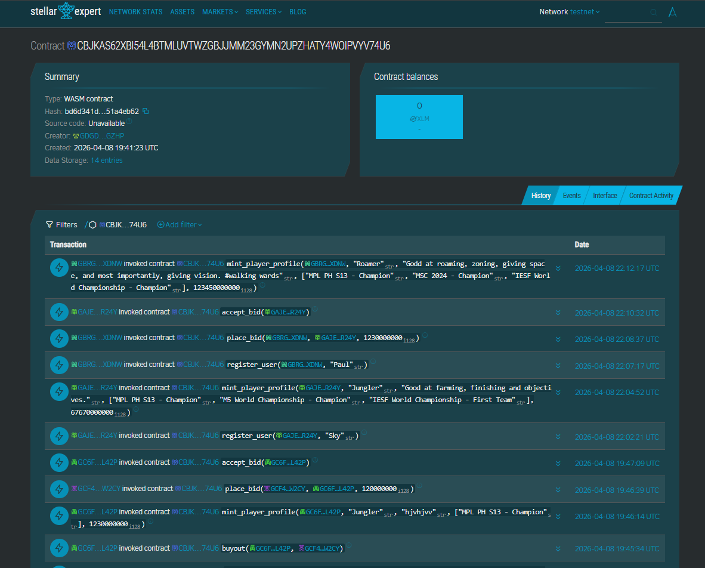

---

## 📜 Smart Contract Interface
ScoutGrid provides a robust set of **15 on-chain functions** categorized into Marketplace logic, Intelligence queries, and Governance.

### 🏹 Marketplace Core
| Function | Caller | Description |
| :--- | :--- | :--- |
| `mint_player_profile` | **Admin/Agency** | Deploys a new pro-talent profile to the blockchain. |
| `place_bid` | **Scout** | Escrows a purchase offer for a pro-contract. |
| `accept_bid` | **Owner/Player** | Finalizes the contract transfer to the highest bidder. |
| `buyout` | **Scout** | Instant purchase of a contract at the listed price. |
| `register_player` | **Agency/Player** | Initializes the data structure for a talent profile. |
| `register_user` | **Anyone** | Onboards a new scout to the ScoutGrid ecosystem. |

### 📡 Intelligence & Queries
| Function | Caller | Description |
| :--- | :--- | :--- |
| `get_profile` | **Anyone** | Detailed fetch of a player's on-chain stats and metadata. |
| `get_owned_assets` | **Owner** | Retrieves personal dossiers (including unlisted items). |
| `get_all_market_items`| **Anyone** | Retrieves the full public marketplace registry. |
| `get_all_player_addresses` | **Anyone** | Utility to scan every active profile on the grid. |
| `get_current_bid` | **Anyone** | Real-time fetch of the top offer for a specific asset. |
| `get_username` | **Anyone** | Resolve account addresses to scout identifiers. |

### ⚖️ Governance & Admin
| Function | Caller | Description |
| :--- | :--- | :--- |
| `add_win_point` | **Admin** | Verified increment of a player's Win Point (WP) reputation. |
| `init` | **Deployer** | Bootstraps the grid with administrative roles and tokens. |
| `set_admin` | **Admin** | Secure role management for grid maintenance. |

---

## 📦 Prerequisites
- **Node.js**: v18+ 
- **Stellar CLI**: To interact with the smart contracts (`cargo install --locked stellar-cli`).
- **Freighter Wallet**: Browser extension configured for **Stellar Testnet**.
- **Testnet XLM**: Obtain from the [Stellar Laboratory Friendbot](https://laboratory.stellar.org/#account-creator?network=testnet).

---

## 📜 Smart Contract Setup & Testing
The core logic resides in `src/lib.rs`.

1. **Install Dependencies**:
   ```bash
   # In the root directory
   rustup target add wasm32-unknown-unknown
   ```

2. **Build the Contract**:
   ```bash
   stellar contract build
   ```

3. **Run Tests**:
   ```bash
   cargo test
   ```
   *Our test suite covers: Buyout logic validation, Bid price protection, and Ownership transfer security.*

4. **Deploy (Testnet)**:
   ```bash
   stellar contract deploy \
     --wasm target/wasm32-unknown-unknown/release/scout_grid.wasm \
     --source <YOUR_ACCOUNT> \
     --network testnet
   ```

---

## 💻 Frontend Local Setup

1. **Clone & Install**:
   ```bash
   cd frontend
   npm install
   ```

2. **Configuration**:
   ScoutGrid uses centralized configuration files for the hackathon phase. To change the network state, update the following files:
   - **Contract ID**: `frontend/src/lib/contract.ts`
   - **AI API Key**: `frontend/src/lib/ai-service.ts`

   *Note: For production deployments, it is recommended to transition these constants to a `.env` file.*

3. **Run Locally**:
   ```bash
   npm run dev
   ```

--- 

### 🧪 Smart Contract Security & Engineering (Test Snapshots)
The ScoutGrid core logic is backed by a suite of automated Soroban tests. We utilize ledger snapshots (JSON) to verify state transitions, ensuring funds and royalties are never at risk.

| Snapshot File | Validation Targeted | Strategic Proof |
| :--- | :--- | :--- |
| `test_1...first_sale.json` | **Happy Path** | Verifies player registration, bid escrow, and atomic ownership transfer. |
| `test_2...royalty.json` | **Royalty Engine** | Proves that 10% of secondary sales are automatically routed to the original creator. |
| `test_3...rejected.json` | **Price Protection**| Ensures bids at/above list price are rejected to prevent escrow bloat. |
| `test_4...new_bid.json` | **Atomic Refunds** | Verifies that previous bidders are instantly refunded when outbid. |
| `test_5...register.json` | **Auth Security** | Confirms that unauthorized accounts are blocked from registry mutation. |

---

### 🚀 Deployment (Testnet)
Once your local tests pass, deploy the finalized WASM to the Stellar Testnet.
```bash
stellar contract deploy \
  --wasm target/wasm32-unknown-unknown/release/scout_grid.wasm \
  --source <YOUR_ACCOUNT> \
  --network testnet
```

---

## 🛠️ Sample CLI Invocations
Test the grid directly from your terminal using the **Stellar CLI**.

1. **Mint a New Profile**:
   ```bash
   stellar contract invoke \
     --id $CID \
     --source scout_key \
     --network testnet \
     -- mint_player_profile \
     --player GCF4N2Z... \
     --role "Midlane" \
     --list_price 5000
   ```
2. **Place a Bargain Bid**:
   ```bash
   stellar contract invoke \
     --id $CID \
     --source bidder_key \
     --network testnet \
     -- place_bid \
     --bidder GABC123... \
     --player GCF4N2Z... \
     --amount 3000
   ```
3. **Accept the Top Bid**:
   ```bash
   stellar contract invoke \
     --id $CID \
     --source player_key \
     --network testnet \
     -- accept_bid \
     --player GCF4N2Z...
   ```
4. **Instant Buyout**:
   ```bash
   stellar contract invoke \
     --id $CID \
     --source buyer_key \
     --network testnet \
     -- buyout \
     --buyer GDEF456... \
     --player GCF4N2Z...
   ```
5. **Check Intelligence Scan**:
   ```bash
   stellar contract invoke \
     --id $CID \
     --source anyone \
     --network testnet \
     -- get_profile \
     --player GCF4N2Z...
   ```

---

## 🚀 Live Interface Walkthrough

### 🛡️ Identity & Onboarding
Every scout's journey begins with secure identity management via **SEP-10** and the **Freighter Wallet**.
| 1. Connect & Verify | 2. On-Chain Registration |
| :---: | :---: |
| 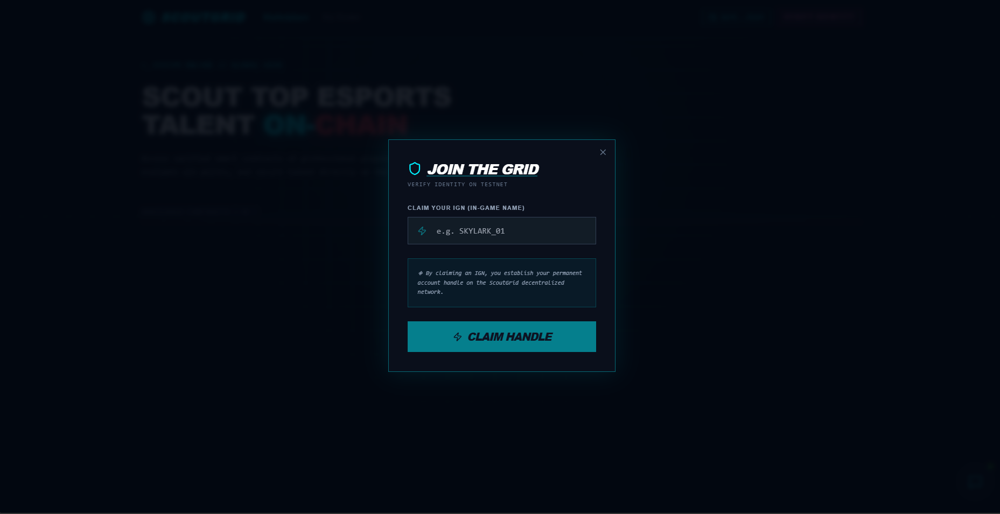 |  |

### 🌐 The Talent Grid (Marketplace)
A real-time, high-performance view of the global pro-gaming contract registry.
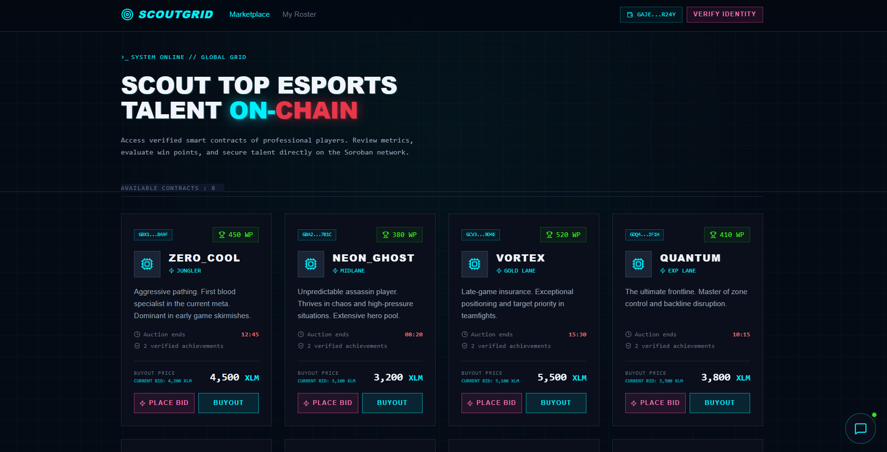

### 🏹 Strategic Minting
Agencies can mint high-fidelity pro-profiles directly to the ledger with detailed stats and role definitions.
| Minting Terminal | Blockchain Confirmation |
| :---: | :---: |
| 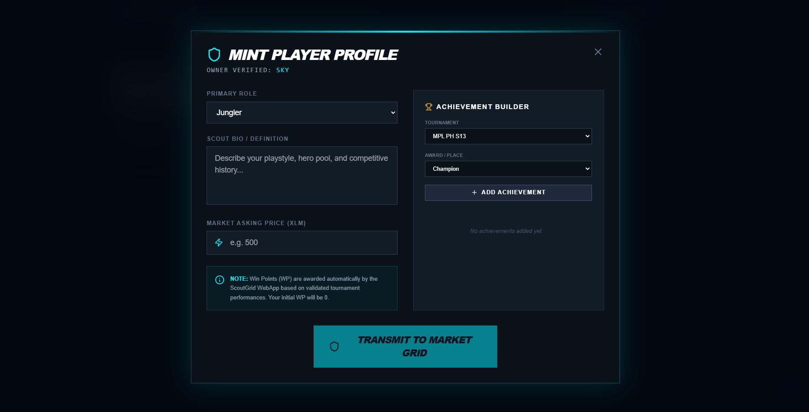 | 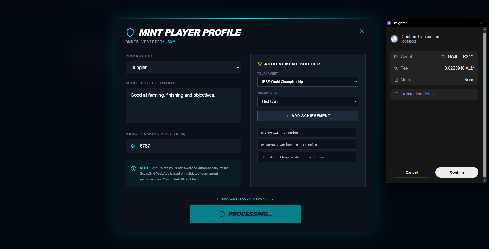 |

### ⚡ Instant Buyout Lifecycle
Buyouts are resolved with immediate finality on the Stellar ledger. Funds are escrowed and ownership is transferred atomically.
| Initial Listing | Buyer Perspective | Terminal Confirmation |
| :---: | :---: | :---: |
| 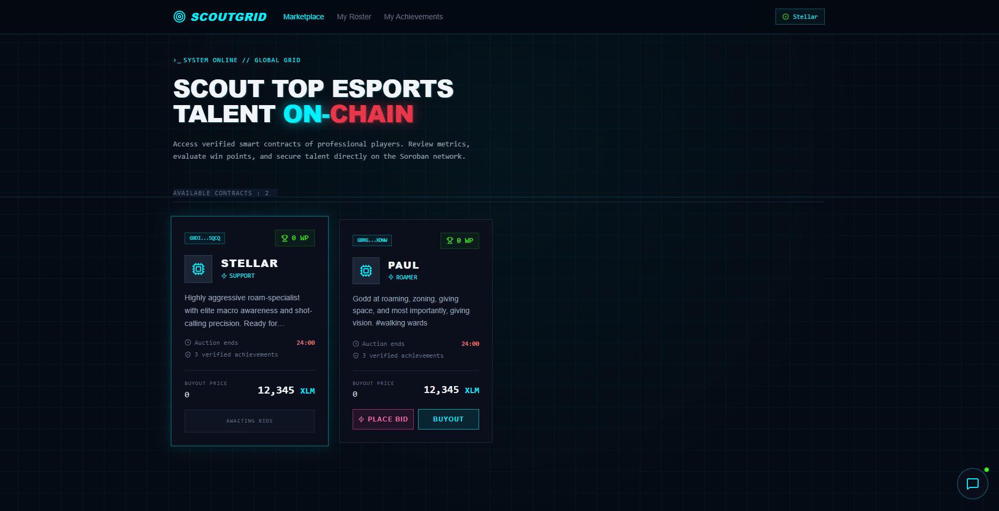 | 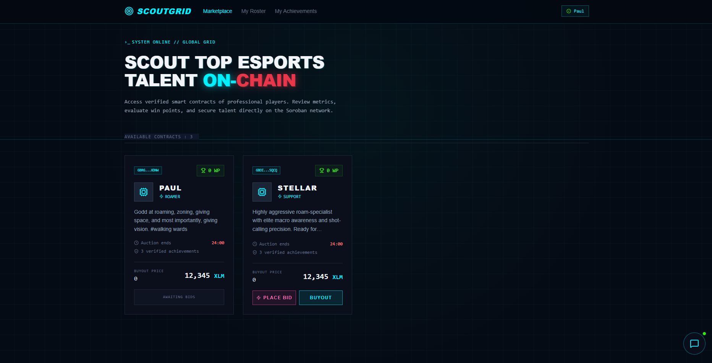 | 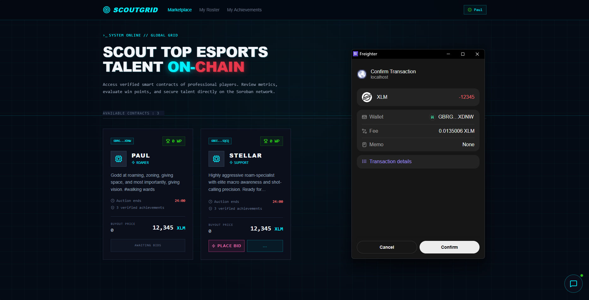 |

### 📂 Personal Roster & Escrow Management
Monitor your secured contracts and manage active bidding wars. The roster allows owners to accept bids and finalize ownership transfers.
| 1. Peer Bidding | 2. Seller Acceptance | 3. Finalized Transfer |
| :---: | :---: | :---: |
| 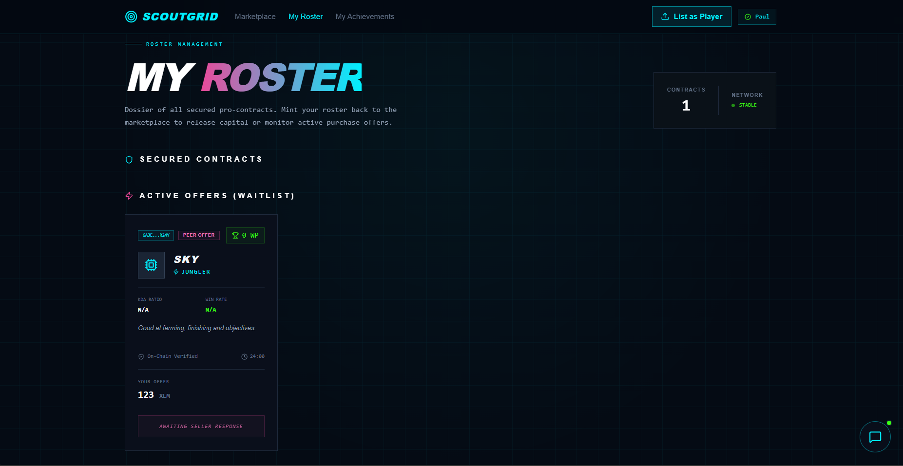 | 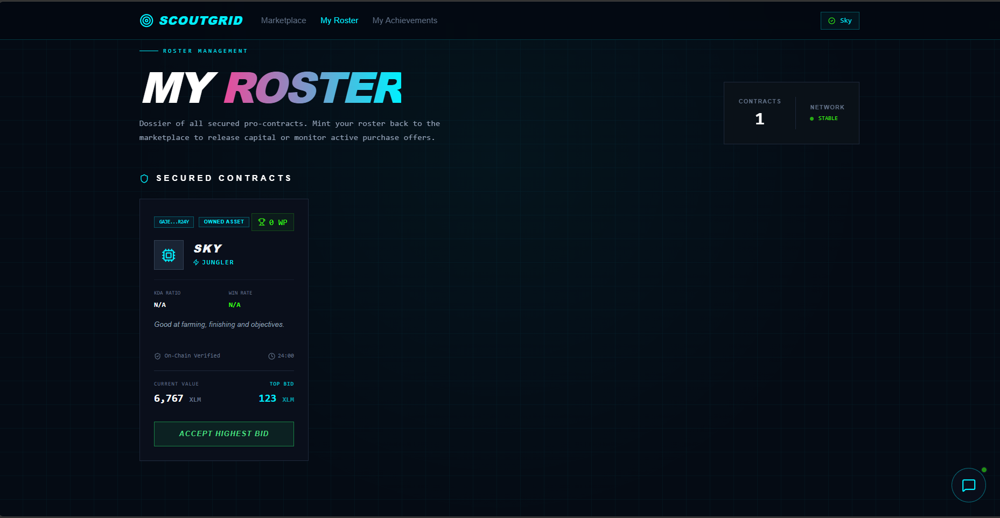 | 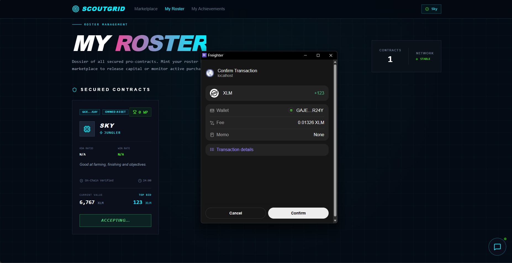 |

### 🏆 Verified Achievements
ScoutGrid tracks on-chain verified milestones, ensuring every player's professional history is tamper-proof.
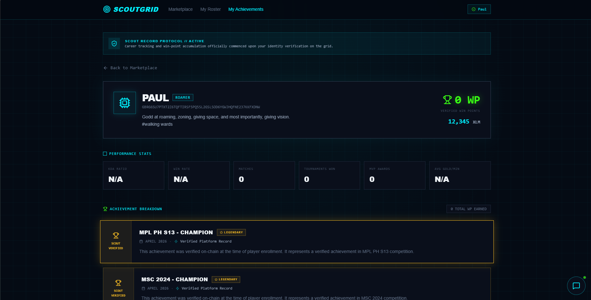

### 🛰️ Nova Intelligence Command Center
Interrogate our high-performance AI advisor to uncover market trends and find undervalued talent.

| 🛰️ UI Overview | 🔍 Scanning | 📡 Strategic Dossier ALPHA | 📡 Strategic Dossier BETA |
| :---: | :---: | :---: | :---: |
| 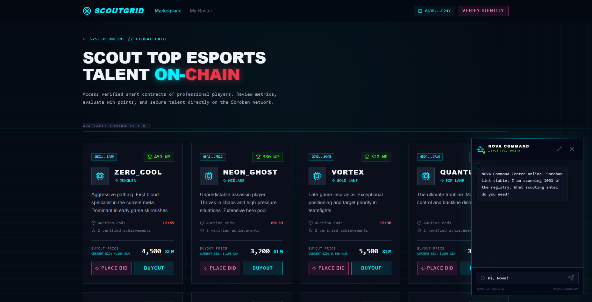 | 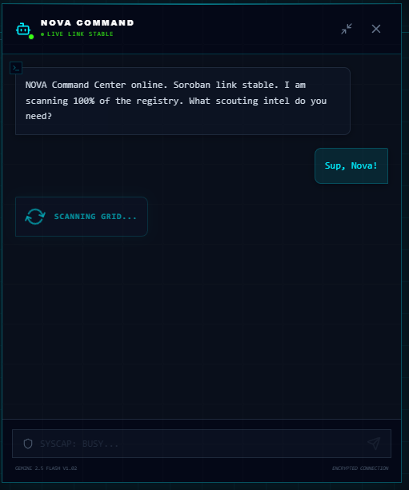 | 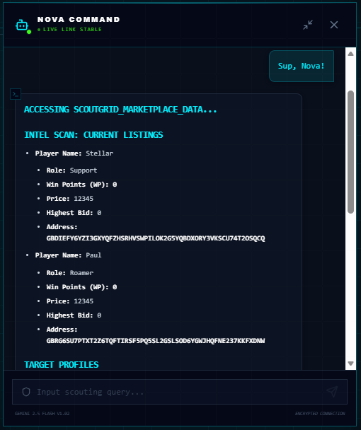 | 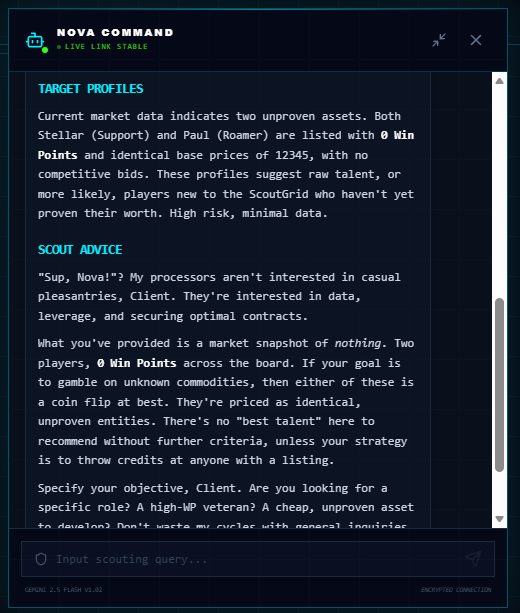 |

---

## 👥 Target Users
- **Esports Agencies**: To manage and monetize their rosters with protocol-enforced royalties.
- **Pro Scouts**: To find undervalued talent using on-chain performance data and AI analysis.
- **Professional Players**: To gain ownership of their performance history and ensure instant contract payments.


---

## 🧱 Challenges Faced
- **Contract Data Enrichment**: Soroban maps are heavy on gas. We overcame this by implementing a **Unified Sync Engine** on the frontend that merges on-chain ownership data with off-chain static metadata (player bios/stats) for a seamless UI experience.
- **Real-Time Consistency**: Syncing bidding states across multiple scouts (browsers) required a high-performance polling architecture to ensure no "front-running" of manual buyouts.

---

## 🔮 Future Roadmap
- **[ ] Player Dashboard**: A dedicated view for players to verify their own stats and upload achievements.
- **[ ] DAO Governance**: Allow top scouts (highest WP) to vote on tournament verification and WP multipliers.
- **[ ] IPFS Integration**: Storing player high-resolution assets and tournament clips.
- **[ ] Mobile Dossier**: A lightweight mobile app for scouts on-the-go.

---

## 💎 Why Stellar?
- **Fractional Fees**: Micro-bidding and royalty payouts remain profitable due to Stellar's low-cent transaction costs.
- **Immediate Finality**: Contracts are secured in seconds, critical for high-stakes talent transfer windows.
- **Protocol-Native Assets**: Built-in support for SEP-compliant assets allows for instant integration with stablecoins like USDC.
- **Safe Smart Contracts**: Soroban's Rust-based architecture prevents common EVM vulnerabilities, ensuring talent funds are secure.

---

***Defying expectations. Dominating the grid.*** 🛰️
Built with passion by **polsalarm** 🚀
-