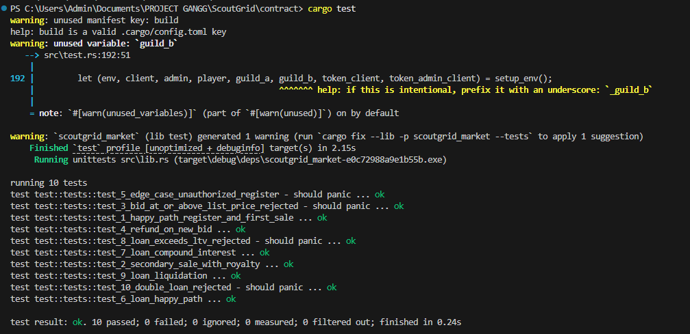
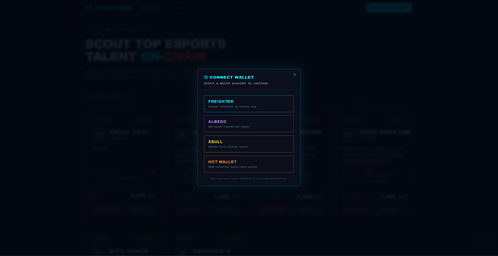
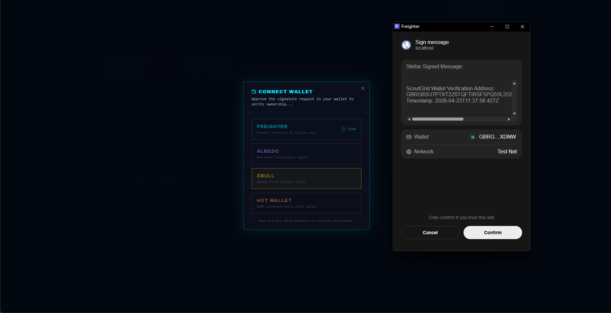
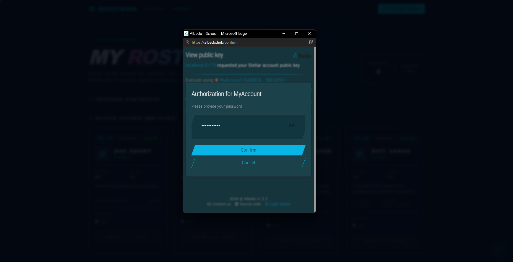
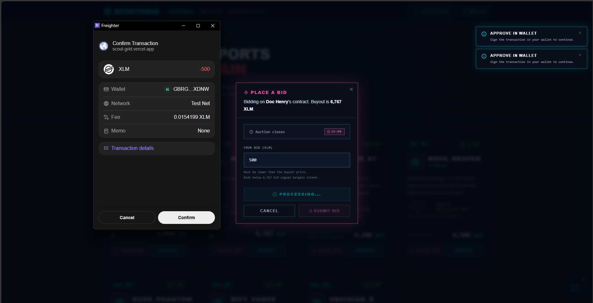
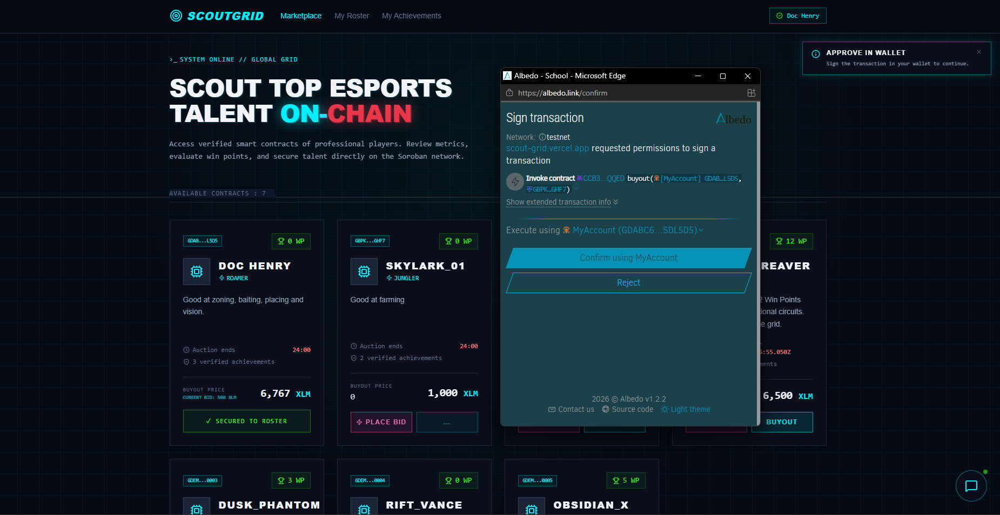
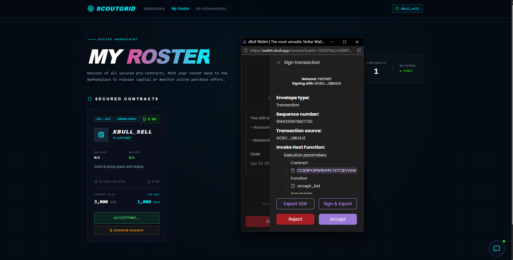
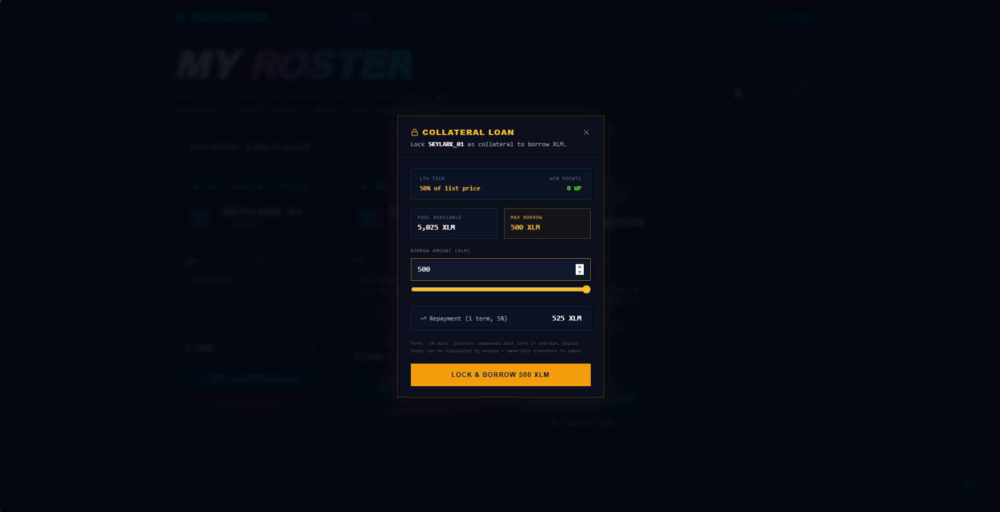
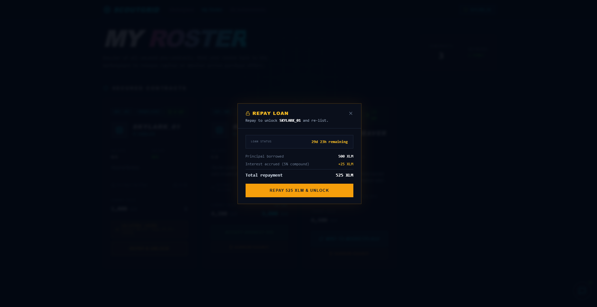

# ⚡ ScoutGrid

> **The Decentralized Grid for Pro-Scouts.** Trustless talent acquisition, on-chain verified profiles, AI-driven market intelligence, and collateralized lending — all on the Soroban blockchain.


---

## 🎬 Demo Video

> **📽️ [Watch the 1-Minute Demo →](#)** *(replace `#` with your video URL after uploading)*
>
> *No voiceover — all functionality is shown via on-screen text captions. Covers: wallet connection, handle registration, marketplace bidding, instant buyout, collateral loans, Nova AI advisor, and on-chain verification.*

| Feature Coverage | Timestamp |
| :--- | :--- |
| Wallet Connection & Identity Verification | 0:07 |
| Handle Registration (On-Chain IGN) | 0:15 |
| Marketplace — Live Talent Grid | 0:22 |
| Bargain Bidding & Escrow | 0:27 |
| Instant Buyout & Ownership Transfer | 0:32 |
| Collateral Loan (Borrow Against Player) | 0:38 |
| Nova AI Market Intelligence | 0:46 |
| Stellar Explorer — On-Chain Proof | 0:52 |

---

## 🌪️ The Problem
Esports scouting is currently broken. Data is siloed in private spreadsheets, talent contracts are opaque, and the transfer of pro-players often involves payment disputes and long delays. Scouts have no way to verify a player's true market value or track their historical performance win-points (WP) in a tamper-proof way.

**And when opportunity strikes — a tournament, a buyout window, a rival guild making moves — independent scouts often can't act fast enough. Not because their roster isn't valuable. Because it's all locked up in contracts they can't easily liquidate.**

## 🛡️ The Soroban Solution
ScoutGrid leverages the **Stellar (Soroban)** blockchain to create a high-performance, transparent marketplace for professional gaming talent — with a built-in financial system that lets scouts leverage what they already own.
- **On-Chain Profiles**: Every player is a unique contract entry, storing WP, roles, and verified achievements directly on the ledger.
- **Atomic Escrow**: Bidding and Buyouts are handled by trustless smart contracts. Funds are only transferred when ownership is secured.
- **Royalty Enforcement**: Contract transfers include automated royalty logic (10% to the original scout/agency) enforced at the protocol level.
- **Collateral Lending**: Scouts can lock player contracts as on-chain collateral to borrow XLM from the community pool — unlocking capital without selling their assets. Loan terms scale with a player's Win Points.
- **AI-Advisor (Nova)**: A Gemini-powered intelligence layer that scans the live blockchain registry to give scouts real-time tactical advice.


---

## 🚀 Core Functions & Features
- **The Marketplace**: A real-time grid to browse, bid on, or buyout pro-gaming contracts.
- **The Roster (Dossier)**: Personal collection management. Track your "Secured Contracts" and "Active Offers."
- **Win-Point (WP) System**: On-chain reputation tracking that increases based on verified tournament performance.
- **Nova AI Advisor**: Interrogate a high-performance AI that knows every contract on the grid to find undervalued talent.
- **Minting Terminal**: Agency tools to deploy new pro-profiles directly to the network.
- **Multi-Wallet Support**: Any scout can connect via Freighter, Albedo, xBull, or HOT Wallet to bid, buy, or sell — wallet-agnostic by design.
- **Collateral Loan System**: Lock a player contract to borrow XLM from the on-chain pool. WP-tiered loan-to-value ratios. Compound interest. Liquidation-on-expiry with community repo auction.

---

## 📂 Project Structure

```text
ScoutGrid/
├── contract/                   # 🦀 Smart Contract Hub (Soroban)
│   ├── src/                    # Rust Source Code
│   │   ├── lib.rs              # Core Marketplace Logic & Functions
│   │   └── test.rs             # Security & Escrow Test Suite
│   ├── test_snapshots/         # Escrow State Assertions
│   ├── Cargo.toml              # Rust Dependency Management
│   └── README.md               # Contract Deployment & Setup Docs
├── docs/                       # 📄 Technical Documentation
│   ├── index.md                # Docs Overview
│   └── contract-client.md      # Soroban Client API Reference
├── frontend/                   # ⚛️ Web3 Interface (React/Vite)
│   ├── src/
│   │   ├── components/
│   │   │   └── ui/             # Tactical UI Components
│   │   │       ├── AIChatbot.tsx   # Nova Command Center (Gemini AI)
│   │   │       ├── PlayerCard.tsx  # Marketplace Contract Display
│   │   │       ├── MintModal.tsx   # Asset Deployment Terminal
│   │   │       ├── WalletModal.tsx # Multi-Wallet Picker
│   │   │       ├── Toast.tsx       # Transaction Notification System
│   │   │       ├── LoanModal.tsx   # Collateral Loan Origination
│   │   │       ├── RepayModal.tsx  # Loan Repayment & Unlock
│   │   │       ├── LoanBadge.tsx   # Collateral Lock Status Indicator
│   │   │       └── Navbar.tsx      # Terminal Navigation
│   │   ├── lib/                # Core Application Logic
│   │   │   ├── ai-service.ts   # Gemini AI Integration & Prompting
│   │   │   ├── contract.ts     # Soroban Universal Sync Engine
│   │   │   ├── store.ts        # Zustand On-Chain State Management
│   │   │   ├── walletKit.ts    # StellarWalletsKit Singleton
│   │   │   └── types.ts        # Shared TypeScript Types
│   │   ├── pages/              # View Layers
│   │   │   ├── Marketplace.tsx # Public Talent Grid
│   │   │   └── MyRoster.tsx    # Personal Secured Dossiers
│   │   └── index.css           # Cyber-Neon Tailwind Styling
└── README.md                   # Professional Technical Dossier
```

---

## 🏗️ Architecture

```text
Browser (React + Vite)
 |-- StellarWalletsKit        (Multi-wallet abstraction layer)
 |   |-- FreighterModule      (Browser extension — Stellar.org)
 |   |-- AlbedoModule         (Web-based signer)
 |   |-- xBullModule          (Mobile-first wallet)
 |   └── HotWalletModule      (NEAR-connected multi-chain wallet)
 |-- @stellar/stellar-sdk     (Transaction building & RPC interaction)
 |-- Universal Sync Engine    (On-chain state management via Zustand)
 |-- Gemini AI SDK            (Intelligence layer & Tactical analysis)

Stellar Testnet
 |-- ScoutGrid Soroban Contract (Marketplace logic, Escrows, Royalties)
 |-- Stellar Asset Contract     (SEP-41 Native XLM payments)
```

> **Zero Backend Requirement**: ScoutGrid has no centralized database. All escrow states, royalties, and win-points live natively on-chain. The Universal Sync Engine mirrors the ledger state for real-time UI updates.

---

## 🛠️ System Components
- **"Global Registry"**: A single-source-of-truth registry maintained on the Soroban ledger, ensuring all scouts see the same talent data instantly.
- **Universal Sync Engine**: A high-performance convergence engine on the frontend that parallelizes on-chain registry fetches with local metadata enrichment.
- **Contract Hardening**: Robust Rust-based logic with exhaustive checks for ownership, bid validity, and state protection.
- **Blockchain-First State**: All roster and marketplace updates hit the on-chain registry first, ensuring changes are visible to all browsers globally with zero stale state.

### Implementation Details:
- **Frontend**: React 19, Vite, TypeScript, Tailwind CSS (Cyberpunk/Glassmorphism UI).
- **Smart Contracts**: Soroban (Rust SDK) deployed on Stellar Testnet.
- **Wallet Integration**: `@creit.tech/stellar-wallets-kit` — unified multi-wallet layer supporting Freighter, Albedo, xBull, and HOT Wallet. Any wallet can bid, buy, sell, or borrow.
- **AI Layer**: Google Gemini 1.5 Flash for market analysis and natural language queries.
- **State Management**: Zustand for high-performance, real-time marketplace and loan state syncing.
- **Transaction Notifications**: Custom Toast system delivering live feedback at every stage — simulate, approve, submit, confirm, or failure.
- **DeFi Loan Engine**: WP-tiered LTV ratios (50–80%), compound interest per 30-day term, liquidation-on-expiry with community repo auction. All enforced on-chain — zero counterparty trust required.

### 🔒 Security, Error Handling & Transactions
ScoutGrid implements rigorous on-chain architecture alongside high-fidelity UI tracking to ensure absolute transparency during every operation.

**On-Chain Error Handling (Soroban):**
The underlying Rust smart contract natively catches, handles, and reverts **15 distinct error states** (`ContractError` enum), including:
- `AlreadyInitialized` & `NotInitialized`: Protects administrator and registry core configuration.
- `Unauthorized`: Prevents unauthorized actors from transferring contracts or spoofing identities.
- `BidTooLow` & `InvalidAmount`: Ensures escrow pricing mechanics are strictly enforced.
- `NotRegistered` & `UserAlreadyRegistered`: Maintains pristine player registration states.
- `NoActiveBid` & `ProfileAlreadyExists`: Prevents duplicate database entries and dead-end executions.
- `LoanAlreadyExists` & `NoActiveLoan`: Prevents double-pledging and phantom repayments.
- `InsufficientPool` & `ExceedsLTV`: Guards the lending pool against over-leverage.
- `CollateralNotOwned`: Ensures only the current contract owner can pledge an asset.
- `LoanNotExpired`: Prevents premature liquidation calls.

**Real-Time Transaction Status (Frontend):**
On the client side, every single interaction (Bidding, Minting, Buyouts, Registration) is channeled through our custom Universal Sync Engine, keeping scouts fully informed of execution progress:
- Every action triggers live state tracking steps visually (e.g., `"Simulating on Soroban..."`, `"Initiating Buyout..."`, `"Claiming Handle..."`).
- The engine actively polls the Soroban RPC `getTransaction` status locally, resolving only upon on-chain finality.
- Successful transactions return instantaneous positive confirmation and instantly refresh the global grid state. Wallet rejections or simulation failures are caught and surfaced as toast notifications with the exact error from the contract.

---

## 🏗️ Stellar Features Used

| Feature | Usage |
| :--- | :--- |
| **Soroban Smart Contracts** | Atomic marketplace logic — lock, release, bid processing, and royalty enforcement. |
| **Native Assets / USDC** | Trustless settlement using Stellar assets, ensuring zero payment risk. |
| **Trustlines** | KYC/Gating logic — ensures only verified agencies can receive high-value contract funds. |
| **Clawback** | Security feature enabling the admin to reverse funds during a verified dispute grace period. |
| **SEP-24** | (Roadmap) Interactive fiat-to-XLM on-ramp via local anchors. |
| **SEP-10** | Wallet-based authentication for secure scout identity management. |

---

## 📍 Deployment & Contract Addresses

| Layer | Environment | Address |
| :--- | :--- | :--- |
| **Marketplace Contract** | Stellar Testnet | `CCB3PY3PW6HYPLTXYT2EYVXW7TXBFDE6ALH3MSSWSKI4IZYO67JGQQED` |
| **Admin/Factory Account** | Stellar Testnet | `GDGDODMJCR6VSSY5Y7TWAXM3SMOZK576QTCLZ6B5O2ISEJQ7JICBGZHP` |
| **Native Asset (XLM)** | Stellar Testnet | `CDLZFC3SYJYDZT7K67VZ75HPJVIEUVNIXF47ZG2FB2RMQQVU2HHGCYSC` |

### 🌐 Live Demo & Video

> **Deployed on Vercel**: [scout-grid.vercel.app](https://scout-grid.vercel.app/)
>
> **Demo Video**: [Watch on YouTube / Loom](#) *(replace `#` with your video link — no voiceover, text captions only)*

### 🌐 On-Chain Explorer Verification
All contract logic, scout identities, and roster transfers are publicly verifiable on the Stellar ledger.


---

## 📜 Smart Contract Interface
ScoutGrid provides a robust set of **21 on-chain functions** categorized into Marketplace logic, DeFi Lending, Intelligence queries, and Governance.

### 🏹 Marketplace Core
| Function | Caller | Description |
| :--- | :--- | :--- |
| `mint_player_profile` | **Admin/Agency** | Deploys a new pro-talent profile to the blockchain. |
| `place_bid` | **Scout** | Escrows a purchase offer for a pro-contract. |
| `accept_bid` | **Owner/Player** | Finalizes the contract transfer to the highest bidder. |
| `buyout` | **Scout** | Instant purchase of a contract at the listed price. |
| `register_player` | **Agency/Player** | Initializes the data structure for a talent profile. |
| `register_user` | **Anyone** | Onboards a new scout to the ScoutGrid ecosystem. |

### 🏦 DeFi Lending (Collateral Loan System)
| Function | Caller | Description |
| :--- | :--- | :--- |
| `fund_pool` | **Anyone** | Deposits XLM into the community lending pool. |
| `take_loan` | **Owner** | Locks a player contract as collateral and borrows XLM. LTV tier determined by Win Points (50–80%). |
| `repay_loan` | **Borrower** | Repays principal + compound interest to unlock the collateral and re-list. |
| `liquidate` | **Anyone** | Callable after loan expiry — transfers ownership to admin for community repo auction. |
| `get_loan` | **Anyone** | Read active loan record for a player address. |
| `get_pool_balance` | **Anyone** | Returns current XLM available in the lending pool. |

### 📡 Intelligence & Queries
| Function | Caller | Description |
| :--- | :--- | :--- |
| `get_profile` | **Anyone** | Detailed fetch of a player's on-chain stats and metadata. |
| `get_owned_assets` | **Owner** | Retrieves personal dossiers (including unlisted items). |
| `get_all_market_items`| **Anyone** | Retrieves the full public marketplace registry. |
| `get_all_player_addresses` | **Anyone** | Utility to scan every active profile on the grid. |
| `get_current_bid` | **Anyone** | Real-time fetch of the top offer for a specific asset. |
| `get_username` | **Anyone** | Resolve account addresses to scout identifiers. |

### ⚖️ Governance & Admin
| Function | Caller | Description |
| :--- | :--- | :--- |
| `add_win_point` | **Admin** | Verified increment of a player's Win Point (WP) reputation. |
| `init` | **Deployer** | Bootstraps the grid with administrative roles and tokens. |
| `set_admin` | **Admin** | Secure role management for grid maintenance. |

---

## 📦 Prerequisites
- **Node.js**: v18+
- **Stellar CLI**: To interact with the smart contracts (`cargo install --locked stellar-cli`).
- **A Supported Wallet** (at least one):
  - [Freighter](https://freighter.app/) — browser extension by Stellar.org *(recommended for development)*
  - [Albedo](https://albedo.link/) — web-based, no install required
  - [xBull](https://xbull.app/) — mobile-first Stellar wallet
  - [HOT Wallet](https://hot-labs.org/) — NEAR-connected multi-chain wallet *(demo mode: bypasses testnet gas for registration)*
- **Testnet XLM**: Obtain from the [Stellar Laboratory Friendbot](https://laboratory.stellar.org/#account-creator?network=testnet).

---

## 📜 Smart Contract Setup & Testing
The core logic resides in `src/lib.rs`.

1. **Install Dependencies**:
   ```bash
   # In the root directory
   rustup target add wasm32-unknown-unknown
   ```

2. **Build the Contract**:
   ```bash
   stellar contract build
   ```

3. **Run Tests**:
   ```bash
   cargo test
   ```
   *Our test suite covers: Buyout logic, Bargain bid mechanics, Atomic refunds, Royalty enforcement, Auth security, Loan happy path, Compound interest math, LTV rejection, Liquidation mechanics, and Double-loan prevention.*

4. **Deploy (Testnet)**:
   ```bash
   stellar contract deploy \
     --wasm target/wasm32v1-none/release/scoutgrid_market.wasm \
     --source <YOUR_ACCOUNT> \
     --network testnet
   ```

---

## 💻 Frontend Local Setup

1. **Clone & Install**:
   ```bash
   cd frontend
   npm install
   ```

2. **Configuration**:
   ScoutGrid uses centralized configuration files for the hackathon phase. To change the network state, update the following files:
   - **Contract ID**: `frontend/src/lib/contract.ts`
   - **AI API Key**: `frontend/src/lib/ai-service.ts`

   *Note: For production deployments, it is recommended to transition these constants to a `.env` file.*

3. **Run Locally**:
   ```bash
   npm run dev
   ```

--- 

### 🧪 Smart Contract Security & Engineering (Test Snapshots)
The ScoutGrid core logic is backed by a suite of **10 automated Soroban tests** — all passing. Tests cover the full marketplace lifecycle AND the DeFi loan system, verifying escrow correctness, royalty enforcement, LTV limits, and compound interest math.

```
running 10 tests
test test::tests::test_5_edge_case_unauthorized_register - should panic ... ok
test test::tests::test_3_bid_at_or_above_list_price_rejected - should panic ... ok
test test::tests::test_8_loan_exceeds_ltv_rejected - should panic ... ok
test test::tests::test_10_double_loan_rejected - should panic ... ok
test test::tests::test_1_happy_path_register_and_first_sale ... ok
test test::tests::test_4_refund_on_new_bid ... ok
test test::tests::test_2_secondary_sale_with_royalty ... ok
test test::tests::test_6_loan_happy_path ... ok
test test::tests::test_7_loan_compound_interest ... ok
test test::tests::test_9_loan_liquidation ... ok

test result: ok. 10 passed; 0 failed; 0 ignored; 0 measured
```

| Test | Validation Targeted | Strategic Proof |
| :--- | :--- | :--- |
| `test_1` | **Happy Path** | Player registration, bargain bid escrow, ownership transfer, `list_price` update to accepted amount. |
| `test_2` | **Royalty Engine** | 10% of secondary sales automatically routed to the original creator on every transfer. |
| `test_3` | **Price Protection** | Bids at or above list price rejected with `ContractError::BidTooLow (#102)`. |
| `test_4` | **Atomic Refunds** | Previous bidder instantly and fully refunded when a new bargain bid replaces theirs. |
| `test_5` | **Auth Security** | Unauthorized accounts blocked from registry mutation — no mock auth, must fail. |
| `test_6` | **Loan Happy Path** | Pool funding, collateral lock, borrow disbursement, repayment, pool yield, re-listing. |
| `test_7` | **Compound Interest** | Ledger advanced 2+ terms — repayment correctly compounds 3× at 5% per term. |
| `test_8` | **LTV Rejection** | Borrow above WP-based max (50% at 0 WP) rejected with `ExceedsLTV (#114)`. |
| `test_9` | **Liquidation** | Expired loan liquidated by any caller — ownership transfers to admin, pool recovers principal. |
| `test_10` | **Double Loan Guard** | Second loan on same collateral rejected with `LoanAlreadyExists (#109)`. |

#### 🔬 Test Run Output
| Cargo Test Results |
| :---: |
|  |

---

### 🚀 Deployment (Testnet)
Once your local tests pass, deploy the finalized WASM to the Stellar Testnet.
```bash
stellar contract deploy \
  --wasm target/wasm32v1-none/release/scoutgrid_market.wasm \
  --source <YOUR_ACCOUNT> \
  --network testnet
```

---

## 🛠️ Sample CLI Invocations
Test the grid directly from your terminal using the **Stellar CLI**.

1. **Mint a New Profile**:
   ```bash
   stellar contract invoke \
     --id $CID \
     --source scout_key \
     --network testnet \
     -- mint_player_profile \
     --player GCF4N2Z... \
     --role "Midlane" \
     --list_price 5000
   ```
2. **Place a Bargain Bid**:
   ```bash
   stellar contract invoke \
     --id $CID \
     --source bidder_key \
     --network testnet \
     -- place_bid \
     --bidder GABC123... \
     --player GCF4N2Z... \
     --amount 3000
   ```
3. **Accept the Top Bid**:
   ```bash
   stellar contract invoke \
     --id $CID \
     --source player_key \
     --network testnet \
     -- accept_bid \
     --player GCF4N2Z...
   ```
4. **Instant Buyout**:
   ```bash
   stellar contract invoke \
     --id $CID \
     --source buyer_key \
     --network testnet \
     -- buyout \
     --buyer GDEF456... \
     --player GCF4N2Z...
   ```
5. **Check Intelligence Scan**:
   ```bash
   stellar contract invoke \
     --id $CID \
     --source anyone \
     --network testnet \
     -- get_profile \
     --player GCF4N2Z...
   ```
6. **Fund the Lending Pool**:
   ```bash
   stellar contract invoke \
     --id $CID \
     --source admin_key \
     --network testnet \
     -- fund_pool \
     --funder GADMIN... \
     --amount 10000000000  # 1000 XLM in stroops
   ```
7. **Take a Collateral Loan**:
   ```bash
   stellar contract invoke \
     --id $CID \
     --source scout_key \
     --network testnet \
     -- take_loan \
     --borrower GSCOUT... \
     --player GPLAYER... \
     --amount 5000000000   # 500 XLM in stroops
   ```
8. **Repay a Loan**:
   ```bash
   stellar contract invoke \
     --id $CID \
     --source scout_key \
     --network testnet \
     -- repay_loan \
     --borrower GSCOUT... \
     --player GPLAYER...
   ```

---

## 🚀 Live Interface Walkthrough

### 🔐 Multi-Wallet Connection
ScoutGrid supports four wallet providers via a unified picker modal. Scouts can connect, bid, buy, and sell using any supported wallet — the contract interaction layer is completely wallet-agnostic.

| Wallet Picker Modal | Freighter Connection | Albedo Connection |
| :---: | :---: | :---: |
|  |  |  |

#### Cross-Wallet Transaction History (Stellar Testnet)
The following screenshots show the same marketplace actions — bid, buyout, and sell — executed from different wallet providers, all verifiable on the Stellar ledger.

| Action | Wallet Used | Stellar Explorer |
| :---: | :---: | :---: |
| Place Bid | Freighter |  |
| Instant Buyout | Albedo |  |
| Accept Bid (Sell) | xBull |  |
| Identity Verified | HOT Wallet | *(Demo mode — identity verified via wallet connection; on-chain registration requires funded testnet account)* |

> All transactions above are publicly verifiable at [stellar.expert](https://stellar.expert/explorer/testnet) using the contract address `CCB3PY3PW6HYPLTXYT2EYVXW7TXBFDE6ALH3MSSWSKI4IZYO67JGQQED`.

---

### 🛡️ Identity & Onboarding
Every scout's journey begins with a wallet connection followed by handle registration. Wallet ownership is verified via a cryptographic signature challenge at connection time.

> **Note:** On-chain IGN registration (`register_user`) writes to the Stellar contract and requires a small gas fee in XLM. For the hackathon demo, wallet connection and identity verification are shown fully functional — the handle is claimed locally after the wallet signature is verified. Full on-chain registration is live and callable on Testnet for wallets with funded accounts (e.g. Freighter + Friendbot).

| 1. Connect & Verify | 2. Claim Handle |
| :---: | :---: |
|  |  |

### 🌐 The Talent Grid (Marketplace)
A real-time, high-performance view of the global pro-gaming contract registry.


### 🏹 Strategic Minting
Agencies can mint high-fidelity pro-profiles directly to the ledger with detailed stats and role definitions.
| Minting Terminal | Blockchain Confirmation |
| :---: | :---: |
|  |  |

### ⚡ Instant Buyout Lifecycle
Buyouts are resolved with immediate finality on the Stellar ledger. Funds are escrowed and ownership is transferred atomically.
| Initial Listing | Buyer Perspective | Terminal Confirmation |
| :---: | :---: | :---: |
|  |  |  |

### 📂 Personal Roster & Escrow Management
Monitor your secured contracts and manage active bidding wars. The roster allows owners to accept bids and finalize ownership transfers.
| 1. Peer Bidding | 2. Seller Acceptance | 3. Finalized Transfer |
| :---: | :---: | :---: |
|  |  |  |

### 🏆 Verified Achievements
ScoutGrid tracks on-chain verified milestones, ensuring every player's professional history is tamper-proof.


### 🛰️ Nova Intelligence Command Center
Interrogate our high-performance AI advisor to uncover market trends and find undervalued talent.

> ⚠️ **Note on Nova AI availability:** Nova is powered by the **Google Gemini API (Free Tier)**. The live instance may return a quota error if the daily free-tier limit has been reached. This is an API key limitation, not a code issue — the integration is fully functional and demonstrated in the demo video. To run Nova locally, replace the `API_KEY` in `frontend/src/lib/ai-service.ts` with your own key from [aistudio.google.com/apikey](https://aistudio.google.com/apikey) (free).

| 🛰️ UI Overview | 🔍 Scanning | 📡 Strategic Dossier ALPHA | 📡 Strategic Dossier BETA |
| :---: | :---: | :---: | :---: |
|  |  |  |  |

---

---

## 💡 Real-World Use Case: Kai's Story

> Kai is an independent esports scout. After months of scouting, he mints two player profiles on ScoutGrid — **Renz** (Jungler, listed at 3,000 XLM) and **Dae** (Roamer, listed at 2,000 XLM). A major regional tournament drops with a **4,000 XLM entry fee** and an 80,000 XLM prize pool. His team is ready. His roster is battle-tested.
>
> **Kai only has 600 XLM.**
>
> The old system: a guild funds him in exchange for **30% of prize winnings and partial co-ownership** of his player contracts. That's the system ScoutGrid was built to disrupt.
>
> **The ScoutGrid way**: Kai opens the Roster page. He locks Renz's contract as collateral (0 WP → 50% LTV → borrows 1,500 XLM). He locks Dae's contract (borrows 1,000 XLM). He now has 3,100 XLM — enough to enter and have runway.
>
> His team finishes **second place**. 18,000 XLM prize. He repays both loans with interest. His contracts are unlocked and re-listed. **Full ownership intact. No guild cut. No dilution.**

This is not a hypothetical — this is asset-backed lending applied to esports. The same mechanic behind mortgages, margin accounts, and invoice financing. ScoutGrid brings it on-chain.

### 🏦 WP-Tiered Loan-to-Value (LTV) Table
A player's reputation directly determines borrowing power. Better players unlock better credit terms.

| Win Points | Max LTV | Example (3,000 XLM list price) |
| :---: | :---: | :---: |
| 0 WP | 50% | 1,500 XLM max borrow |
| 1–2 WP | 55% | 1,650 XLM max borrow |
| 3–5 WP | 65% | 1,950 XLM max borrow |
| 6–9 WP | 72% | 2,160 XLM max borrow |
| 10+ WP | 80% | 2,400 XLM max borrow |

> Interest compounds at **5% per 30-day term**. Unpaid loans can be liquidated — the contract transfers to admin for community repo auction with a protocol fee.

| Loan Modal | Repay Modal |
| :---: | :---: |
|  |  |

---

## 👥 Target Users
- **Esports Agencies**: To manage and monetize their rosters with protocol-enforced royalties.
- **Pro Scouts**: To find undervalued talent using on-chain performance data and AI analysis.
- **Professional Players**: To gain ownership of their performance history and ensure instant contract payments.


---

## 🧱 Challenges Faced
- **Contract Data Enrichment**: Soroban maps are heavy on gas. We overcame this by implementing a **Unified Sync Engine** on the frontend that merges on-chain ownership data with profile metadata for a seamless UI experience.
- **Real-Time Consistency**: Syncing bidding states across multiple scouts (browsers) required a high-performance polling architecture to ensure no "front-running" of manual buyouts.
- **Multi-Wallet Abstraction**: Replacing hard-coded Freighter calls with a wallet-agnostic layer required migrating all transaction signing through `StellarWalletsKit` and resolving Protocol 22 XDR incompatibilities introduced by the `@stellar/stellar-sdk` v15 upgrade. Each wallet provider (browser extension, web-based, hardware) required its own connection and signing flow while the contract layer remained identical.
- **Bargain Bid Mechanics**: The contract implements a reverse-price bidding model — scouts bid *below* the list price and the owner accepts the best offer. Enforcing this correctly required removing a directional bid guard (which incorrectly blocked valid lower bids from replacing higher ones) and ensuring `list_price` is updated to the accepted bid on transfer, so secondary-sale royalty logic always operates on the correct baseline.
- **Collateral Loan Design**: Implementing compound interest in `no_std` Rust (no floating point) required integer math with per-term iteration — `repayment += repayment * 500 / 10_000` per term — which mirrors financial compound logic without precision loss. WP-tiered LTV required a match-based dispatch function callable both from contract logic and indirectly from the test suite. Differentiating "unlisted because sold" from "unlisted because collateralized" is handled by the existence of a `LoanRecord` key rather than a new profile field, keeping the schema clean.

---

## 🔮 Future Roadmap
- **[ ] Player Dashboard**: A dedicated view for players to verify their own stats and upload achievements.
- **[ ] DAO Governance**: Allow top scouts (highest WP) to vote on tournament verification and WP multipliers.
- **[ ] IPFS Integration**: Storing player high-resolution assets and tournament clips.
- **[ ] Mobile Dossier**: A lightweight mobile app for scouts on-the-go.
- **[ ] Guild Liquidity Providers**: Open the lending pool to any guild — contributors earn a proportional share of interest revenue, turning the pool into a yield-generating protocol.
- **[ ] Upgrade Function**: Add `upgrade` entrypoint to the contract so future deployments preserve the same contract ID and existing on-chain data.
- **[ ] Repo Auction UI**: Dedicated "Repo Grid" tab surfacing liquidated contracts available for community bidding at discounted prices.

---

## 💎 Why Stellar?
- **Fractional Fees**: Micro-bidding and royalty payouts remain profitable due to Stellar's low-cent transaction costs.
- **Immediate Finality**: Contracts are secured in seconds, critical for high-stakes talent transfer windows.
- **Protocol-Native Assets**: Built-in support for SEP-compliant assets allows for instant integration with stablecoins like USDC.
- **Safe Smart Contracts**: Soroban's Rust-based architecture prevents common EVM vulnerabilities, ensuring talent funds are secure.

---

***Defying expectations. Dominating the grid.*** 🛰️
Built with passion by **polsalarm** 🚀
-