# ⚡ ScoutGrid

> **The Decentralized Grid for Pro-Scouts.** Trustless talent acquisition, on-chain verified profiles, AI-driven market intelligence, and collateralized lending — all on Avalanche.


---

> **📦 Migration note:** ScoutGrid was originally built for Stellar/Soroban and has since been **fully ported to Avalanche** — new Solidity contract, new Foundry test suite, new viem/wagmi frontend, new wallet stack. Nothing Stellar-specific remains in the codebase. The full migration plan, the design decisions behind the port, and a bug the process caught in the original contract are documented in [`AVALANCHE_MIGRATION_PLAN.md`](./AVALANCHE_MIGRATION_PLAN.md).
>
> Some screenshots and the demo video below still show the pre-migration Stellar build — flagged inline where that's the case, and slated for re-recording once the contract is live on Fuji.

---

## 🎬 Demo Video

> **📽️ [Watch the 1-Minute Demo →](https://drive.google.com/file/d/1V9HstPxJKp1PWQVQDrBdA8UQ0tqmqs99/view?usp=sharing)**
>
> *No voiceover — all functionality is shown via on-screen text captions. Covers: wallet connection, handle registration, marketplace bidding, instant buyout, collateral loans, Nova AI advisor, and on-chain verification. Recorded on the pre-migration Stellar build — an Avalanche re-record is queued for after Fuji deployment.*

---
## 🌐 Live Demo

> **Deployed on Vercel**: [scout-grid.vercel.app](https://scout-grid.vercel.app/)
> *(Redeploy to the Avalanche build is pending the Fuji contract deployment below.)*

---

## 🌪️ The Problem
Esports scouting is currently broken. Data is siloed in private spreadsheets, talent contracts are opaque, and the transfer of pro-players often involves payment disputes and long delays. Scouts have no way to verify a player's true market value or track their historical performance win-points (WP) in a tamper-proof way.

**And when opportunity strikes — a tournament, a buyout window, a rival guild making moves — independent scouts often can't act fast enough. Not because their roster isn't valuable. Because it's all locked up in contracts they can't easily liquidate.**

## 🛡️ The Avalanche Solution
ScoutGrid leverages **Avalanche's C-Chain** to create a high-performance, transparent marketplace for professional gaming talent — with a built-in financial system that lets scouts leverage what they already own.
- **On-Chain Profiles**: Every player is a unique contract entry, storing WP, roles, and verified achievements directly in contract storage.
- **Atomic Escrow**: Bidding and Buyouts are handled by a trustless, `nonReentrant`-guarded smart contract. Funds are only released when ownership is secured.
- **Royalty Enforcement**: Contract transfers include automated royalty logic (10% to the original scout/agency) enforced at the protocol level.
- **Collateral Lending**: Scouts can lock player contracts as on-chain collateral to borrow AVAX from the community pool — unlocking capital without selling their assets. Loan terms scale with a player's Win Points.
- **AI-Advisor (Nova)**: A Gemini-powered intelligence layer that scans the live on-chain registry to give scouts real-time tactical advice.


---

## 🚀 Core Functions & Features
- **The Marketplace**: A real-time grid to browse, bid on, or buyout pro-gaming contracts.
- **The Roster (Dossier)**: Personal collection management. Track your "Secured Contracts" and "Active Offers."
- **Win-Point (WP) System**: On-chain reputation tracking that increases based on verified tournament performance.
- **Nova AI Advisor**: Interrogate a high-performance AI that knows every contract on the grid to find undervalued talent.
- **Minting Terminal**: Agency tools to deploy new pro-profiles directly to the network.
- **Multi-Wallet Support**: Any scout can connect via Core, MetaMask, Rabby, or WalletConnect to bid, buy, or sell — wallet-agnostic by design, auto-detected via EIP-6963.
- **Collateral Loan System**: Lock a player contract to borrow AVAX from the on-chain pool. WP-tiered loan-to-value ratios. Compound interest. Liquidation-on-expiry with community repo auction.

---

## 📂 Project Structure

```text
ScoutGrid/
├── contracts/                   # ⛓️ Smart Contract Hub (Solidity / Foundry)
│   ├── src/
│   │   └── ScoutGridMarket.sol # Core Marketplace + Lending Logic
│   ├── test/
│   │   └── ScoutGridMarket.t.sol # 16-test Foundry suite (incl. reentrancy + fuzz)
│   ├── script/
│   │   └── Deploy.s.sol        # Deployment script (any --rpc-url)
│   ├── foundry.toml            # Foundry config (Fuji RPC + Snowtrace verifier)
│   └── README.md               # Contract build/deploy quickstart
├── AVALANCHE_MIGRATION_PLAN.md # Full migration plan + locked design decisions
├── frontend/                    # ⚛️ Web3 Interface (React/Vite)
│   ├── src/
│   │   ├── components/
│   │   │   └── ui/             # Tactical UI Components
│   │   │       ├── AIChatbot.tsx   # Nova Command Center (Gemini AI)
│   │   │       ├── PlayerCard.tsx  # Marketplace Contract Display
│   │   │       ├── MintModal.tsx   # Asset Deployment Terminal
│   │   │       ├── WalletModal.tsx # Multi-Wallet Picker
│   │   │       ├── Toast.tsx       # Transaction Notification System
│   │   │       ├── LoanModal.tsx   # Collateral Loan Origination
│   │   │       ├── RepayModal.tsx  # Loan Repayment & Unlock
│   │   │       ├── LoanBadge.tsx   # Collateral Lock Status Indicator
│   │   │       └── Navbar.tsx      # Terminal Navigation
│   │   ├── lib/                # Core Application Logic
│   │   │   ├── ai-service.ts   # Gemini AI Integration & Prompting
│   │   │   ├── chain.ts        # Single source of truth for chain config
│   │   │   ├── abi.ts          # Auto-generated ABI (from `forge build`)
│   │   │   ├── contract.ts     # viem/wagmi contract client + sync engine
│   │   │   ├── store.ts        # Zustand On-Chain State Management
│   │   │   ├── walletKit.ts    # wagmi config (EIP-6963 wallet discovery)
│   │   │   └── types.ts        # Shared TypeScript Types
│   │   ├── pages/              # View Layers
│   │   │   ├── Marketplace.tsx # Public Talent Grid
│   │   │   └── MyRoster.tsx    # Personal Secured Dossiers
│   │   └── index.css           # Cyber-Neon Tailwind Styling
└── README.md                   # Professional Technical Dossier
```

---

## 🏗️ Architecture

```text
Browser (React + Vite)
 |-- wagmi                    (Wallet connection + framework-agnostic actions)
 |   |-- EIP-6963 discovery   (Core, MetaMask, Rabby — auto-detected, zero config)
 |   └── WalletConnect        (Any mobile wallet via QR)
 |-- viem                     (Transaction building, ABI encoding/decoding, RPC)
 |-- Universal Sync Engine    (On-chain state management via Zustand)
 |-- Gemini AI SDK            (Intelligence layer & Tactical analysis)

Avalanche Fuji C-Chain (chainId 43113)
 └── ScoutGridMarket.sol       (Marketplace logic, escrow, royalties, lending pool — native AVAX)
```

> **Zero Backend Requirement**: ScoutGrid has no centralized database. All escrow states, royalties, and win-points live natively in contract storage. The Universal Sync Engine mirrors chain state for real-time UI updates via `eth_call`.

---

## 🛠️ System Components
- **"Global Registry"**: A single-source-of-truth registry maintained in contract storage, ensuring all scouts see the same talent data instantly.
- **Universal Sync Engine**: A high-performance convergence engine on the frontend that parallelizes on-chain registry fetches with local metadata enrichment.
- **Contract Hardening**: `ReentrancyGuard`-protected state mutators, checks-effects-interactions ordering, and a pull-payment fallback so a hostile bidder can never brick a listing.
- **Blockchain-First State**: All roster and marketplace updates hit the on-chain registry first, ensuring changes are visible to all browsers globally with zero stale state.

### Implementation Details:
- **Frontend**: React 19, Vite, TypeScript, Tailwind CSS (Cyberpunk/Glassmorphism UI).
- **Smart Contracts**: Solidity 0.8.26, built and tested with Foundry, deployed on Avalanche Fuji C-Chain.
- **Wallet Integration**: `wagmi` + EIP-6963 multi-provider discovery — Core, MetaMask, and Rabby are detected automatically with zero per-wallet configuration; WalletConnect covers everything else.
- **Chain Client**: `viem` — typed contract calls, automatic custom-error decoding, and `simulateContract` → `writeContract` → `waitForTransactionReceipt` transaction flow.
- **AI Layer**: Google Gemini 2.5 Flash for market analysis and natural language queries.
- **State Management**: Zustand for high-performance, real-time marketplace and loan state syncing.
- **Transaction Notifications**: Custom Toast system delivering live feedback at every stage — simulate, approve, submit, confirm, or failure.
- **DeFi Loan Engine**: WP-tiered LTV ratios (50–80%), compound interest per 30-day term, liquidation-on-expiry with community repo auction. All enforced on-chain — zero counterparty trust required.

### 🔒 Security, Error Handling & Transactions
ScoutGrid implements rigorous on-chain architecture alongside high-fidelity UI tracking to ensure absolute transparency during every operation.

**On-Chain Error Handling (Solidity):**
The contract natively reverts with **19 distinct custom errors**, decoded by name on the client via viem — no more guessing at opaque revert strings:
- `AlreadyInitialized` — guards the constructor's admin bootstrap.
- `Unauthorized`: Prevents unauthorized actors from transferring contracts, changing admin, or accepting bids they don't own.
- `BidTooLow` & `InvalidAmount`: Ensures escrow pricing mechanics are strictly enforced.
- `NotRegistered` & `UserAlreadyRegistered`: Maintains pristine player registration states.
- `NoActiveBid` & `ProfileAlreadyExists` / `ProfileNotFound`: Prevents duplicate entries and dead-end executions.
- `LoanAlreadyExists` & `NoActiveLoan`: Prevents double-pledging and phantom repayments.
- `InsufficientPool` & `ExceedsLTV`: Guards the lending pool against over-leverage.
- `CollateralNotOwned`: Ensures only the current contract owner can pledge an asset.
- `LoanNotExpired`: Prevents premature liquidation calls.
- `NotListed`: Blocks bids/buyouts on collateral that's currently loan-locked.
- `BioTooLong` & `TooManyAchievements`: Bounds on-chain string storage to keep mint gas predictable.
- `WrongPaymentAmount` & `TransferFailed`: Guards native-AVAX payment flows and refund delivery.

**Real-Time Transaction Status (Frontend):**
On the client side, every single interaction (Bidding, Minting, Buyouts, Registration) is channeled through our custom Universal Sync Engine, keeping scouts fully informed of execution progress:
- Every action triggers live state tracking steps visually (e.g., `"Simulating Transaction..."`, `"Approve in Wallet..."`, `"Transaction Submitted..."`).
- The engine calls `waitForTransactionReceipt` locally, resolving only upon on-chain finality.
- Successful transactions return instantaneous positive confirmation and instantly refresh the global grid state. Wallet rejections or simulation failures are caught and surfaced as toast notifications with the exact decoded error from the contract.

---

## ⚡ Avalanche Features Used

| Feature | Usage |
| :--- | :--- |
| **Avalanche C-Chain (Fuji)** | EVM-equivalent execution environment — atomic marketplace logic, escrow, bid processing, and royalty enforcement. |
| **Native AVAX payments** | All value flows (bids, buyouts, loans, repayments) use `payable`/`msg.value` — one signature per action, no ERC20 `approve()` round-trip. |
| **EIP-6963 multi-wallet discovery** | Core, MetaMask, and Rabby are detected automatically as they announce themselves — no hard-coded wallet integrations to maintain. |
| **OpenZeppelin `ReentrancyGuard`** | Every state-mutating, value-transferring function is reentrancy-guarded — a requirement that didn't exist on the Soroban version (Stellar's token transfers can't re-enter; EVM `.call{value:}` can). |
| **Custom Solidity errors** | Every revert path decodes to a named error client-side via viem, instead of an opaque simulation failure string. |
| **Foundry `vm.warp` time travel** | The full loan lifecycle — including 30-day compounding and post-due liquidation — is tested locally without waiting 30 real days. |
| **Snowtrace verification** *(pending deploy)* | Source-verified contract, giving anyone a public, byte-for-byte match between deployed bytecode and this repo. |

---

## 📍 Deployment & Contract Addresses

| Layer | Environment | Address |
| :--- | :--- | :--- |
| **Marketplace Contract** | Avalanche Fuji (chainId `43113`) | *Pending — deployment blocked on funding a Fuji wallet. Deploy with `forge script script/Deploy.s.sol --rpc-url fuji --broadcast --verify` from `contracts/`.* |
| **Admin Account** | Avalanche Fuji | *Set to the deploying wallet unless `ADMIN_ADDRESS` is overridden.* |
| **Native Asset** | AVAX (native — no token contract) | n/a |

**Already validated:** every function below was run end-to-end against a local Foundry Anvil devnet during the port — see [`AVALANCHE_MIGRATION_PLAN.md`](./AVALANCHE_MIGRATION_PLAN.md) for the full dry-run walkthrough (register → mint → bid → accept → fund pool → take loan → repay with overpayment refund → liquidate after expiry), with every balance matching hand-calculated numbers to the wei.

### 🌐 On-Chain Explorer Verification
Once deployed, all contract logic, scout identities, and roster transfers will be publicly verifiable on Snowtrace (Fuji's block explorer), with the source verified via `forge script ... --verify`.

---

## 📜 Smart Contract Interface
ScoutGrid provides a robust set of **26 on-chain functions** categorized into Marketplace logic, DeFi Lending, Intelligence queries, and Governance.

### 🏹 Marketplace Core
| Function | Caller | Description |
| :--- | :--- | :--- |
| `mintPlayerProfile` | **Registered scout** | Deploys a new pro-talent profile to the contract registry. |
| `placeBid` | **Scout** (`payable`) | Escrows a purchase offer (in native AVAX) for a pro-contract. |
| `acceptBid` | **Owner/Player** | Finalizes the contract transfer to the highest bidder. |
| `buyout` | **Scout** (`payable`) | Instant purchase of a contract at the listed price. |
| `registerUser` | **Anyone** | Onboards a new scout to the ScoutGrid ecosystem. |
| `withdrawRefund` | **Anyone** | Pull-payment escape hatch — recovers a refund that failed to deliver directly (e.g. a reverting recipient contract). |

### 🏦 DeFi Lending (Collateral Loan System)
| Function | Caller | Description |
| :--- | :--- | :--- |
| `fundPool` | **Anyone** (`payable`) | Deposits AVAX into the community lending pool. |
| `takeLoan` | **Owner** | Locks a player contract as collateral and borrows AVAX. LTV tier determined by Win Points (50–80%). |
| `repayLoan` | **Borrower** (`payable`) | Repays principal + compound interest to unlock the collateral and re-list. Overpayment is refunded automatically. |
| `liquidate` | **Anyone** | Callable after loan expiry — transfers ownership to admin for community repo auction. The pool absorbs the loss; it does not double-count the principal. |
| `getLoan` | **Anyone** | Read active loan record for a player address. |
| `getPoolBalance` | **Anyone** | Returns current AVAX available in the lending pool. |

### 📡 Intelligence & Queries
| Function | Caller | Description |
| :--- | :--- | :--- |
| `getProfile` | **Anyone** | Detailed fetch of a player's on-chain stats and metadata. |
| `getOwnedAssets` | **Anyone** | Retrieves an owner's dossier (including loan-locked items). |
| `getAllMarketItems`| **Anyone** | Retrieves the full public marketplace registry (listed items only). |
| `getMarketItemsPaged` | **Anyone** | Paginated variant, defensive against `eth_call` gas caps on large registries. |
| `getAllPlayerAddresses` | **Anyone** | Utility to scan every active profile on the grid. |
| `getCurrentBid` | **Anyone** | Real-time fetch of the top offer for a specific asset. |
| `getUsername` | **Anyone** | Resolve account addresses to scout identifiers. |
| `registryLength` | **Anyone** | Total number of minted profiles. |

### ⚖️ Governance & Admin
| Function | Caller | Description |
| :--- | :--- | :--- |
| `addWinPoint` | **Admin** | Verified increment of a player's Win Point (WP) reputation. |
| `setAdmin` | **Admin** | Secure role management for grid maintenance. |

---

## 📦 Prerequisites
- **Node.js**: v20+
- **Foundry**: To build, test, and deploy the smart contract (`curl -L https://foundry.paradigm.xyz | bash && foundryup`).
- **A Supported Wallet** (at least one):
  - [Core](https://core.app/) — Avalanche's native wallet extension *(recommended)*
  - [MetaMask](https://metamask.io/) — the most widely used browser wallet
  - [Rabby](https://rabby.io/) — multi-chain wallet built for DeFi
  - **WalletConnect** — scan a QR code with any mobile wallet
- **Testnet AVAX**: Obtain from the [Avalanche Fuji faucet](https://core.app/tools/testnet-faucet) (requires a GitHub login or a small mainnet AVAX balance).

---

## 📜 Smart Contract Setup & Testing
The core logic resides in `contracts/src/ScoutGridMarket.sol`.

1. **Install Dependencies**:
   ```bash
   cd contracts
   forge install
   ```

2. **Build the Contract**:
   ```bash
   forge build
   ```

3. **Run Tests**:
   ```bash
   forge test -vv
   ```
   *Our suite covers: Buyout logic, bargain-bid mechanics, atomic refunds, royalty enforcement, loan happy path, compound-interest math (via `vm.warp`), LTV rejection, liquidation mechanics, double-loan prevention, an excess-repayment refund, a reentrancy attack on the bid-refund path, a pull-payment fallback for a reverting recipient, and a solvency-invariant fuzz test.*

4. **Deploy (Fuji Testnet)**:
   ```bash
   export PRIVATE_KEY=0x...   # deployer key — becomes admin unless ADMIN_ADDRESS is set
   forge script script/Deploy.s.sol --rpc-url fuji --broadcast --verify -vvvv
   ```

---

## 💻 Frontend Local Setup

1. **Clone & Install**:
   ```bash
   cd frontend
   npm install --legacy-peer-deps
   ```

2. **Configuration**:
   ```bash
   # frontend/.env
   VITE_GEMINI_API_KEY=...
   VITE_CONTRACT_ADDRESS=0x...          # from the forge script deploy output
   VITE_WALLETCONNECT_PROJECT_ID=...    # optional — only needed for the WalletConnect connector
   ```

3. **Run Locally**:
   ```bash
   npm run dev
   ```

---

### 🧪 Smart Contract Security & Engineering (Test Suite)
The ScoutGrid core logic is backed by a suite of **16 automated Foundry tests** — all passing. Tests cover the full marketplace lifecycle, the DeFi loan system, AND EVM-specific attack surfaces that don't exist on the original Soroban contract.

```
Ran 16 tests for test/ScoutGridMarket.t.sol:ScoutGridMarketTest
[PASS] testFuzz_SolvencyInvariant_AcrossBidSequence(uint96,uint96) (runs: 256, μ: 351750, ~: 351546)
[PASS] test_HappyPath_RegisterAndFirstSale() (gas: 331582)
[PASS] test_LoanCompoundInterest() (gas: 393332)
[PASS] test_LoanHappyPath() (gas: 401444)
[PASS] test_LoanLiquidation_PoolAbsorbsLoss() (gas: 399196)
[PASS] test_PendingRefundFallback_RevertingReceiver() (gas: 472970)
[PASS] test_ReentrancyOnPlaceBidRefund_ReentrantCallIsBlocked() (gas: 588672)
[PASS] test_RefundOnNewBid() (gas: 346862)
[PASS] test_RepayLoanRefundsExcessMsgValue() (gas: 397264)
[PASS] test_RevertWhen_BidAtOrAboveListPrice() (gas: 280915)
[PASS] test_RevertWhen_BidOnLoanLockedCollateral() (gas: 446712)
[PASS] test_RevertWhen_BuyoutWrongMsgValue() (gas: 280972)
[PASS] test_RevertWhen_DoubleLoan() (gas: 438425)
[PASS] test_RevertWhen_LoanExceedsLTV() (gas: 358864)
[PASS] test_RevertWhen_MintWithoutRegister() (gas: 14107)
[PASS] test_SecondarySaleWithRoyalty() (gas: 365348)

Suite result: ok. 16 passed; 0 failed; 0 skipped
```

| Test | Validation Targeted | Strategic Proof |
| :--- | :--- | :--- |
| `test_HappyPath_RegisterAndFirstSale` | **Happy Path** | Player registration, bargain-bid escrow, ownership transfer, `listPrice` update to accepted amount. |
| `test_SecondarySaleWithRoyalty` | **Royalty Engine** | 10% of secondary sales automatically routed to the original creator on every transfer. |
| `test_RevertWhen_BidAtOrAboveListPrice` | **Price Protection** | Bids at or above list price rejected with `BidTooLow`. |
| `test_RefundOnNewBid` | **Atomic Refunds** | Previous bidder instantly and fully refunded when a new bargain bid replaces theirs. |
| `test_RevertWhen_MintWithoutRegister` | **Auth Security** | Unregistered accounts blocked from minting a profile. |
| `test_LoanHappyPath` | **Loan Happy Path** | Pool funding, collateral lock, borrow disbursement, repayment, pool yield, re-listing. |
| `test_RepayLoanRefundsExcessMsgValue` | **Overpayment Safety** | Repaying with more AVAX than owed refunds the excess automatically. |
| `test_LoanCompoundInterest` | **Compound Interest** | Time warped 2+ terms via `vm.warp` — repayment correctly compounds 3× at 5% per term. |
| `test_RevertWhen_LoanExceedsLTV` | **LTV Rejection** | Borrow above WP-based max (50% at 0 WP) rejected with `ExceedsLTV`. |
| `test_LoanLiquidation_PoolAbsorbsLoss` | **Liquidation & Solvency** | Expired loan liquidated by any caller — ownership transfers to admin, and the pool correctly does **not** double-count the principal (a real accounting bug caught and fixed during the Avalanche port — see the migration plan §2.5). |
| `test_RevertWhen_DoubleLoan` | **Double Loan Guard** | Second loan on the same collateral rejected with `LoanAlreadyExists`. |
| `test_RevertWhen_BidOnLoanLockedCollateral` | **Collateral Lock** | Bidding on loan-locked collateral rejected with `NotListed` — a gap that existed in the original Soroban contract, closed during the port. |
| `test_RevertWhen_BuyoutWrongMsgValue` | **Exact-Payment Guard** | Buyout reverts unless `msg.value` matches the list price exactly. |
| `test_ReentrancyOnPlaceBidRefund_ReentrantCallIsBlocked` | **Reentrancy Defense** | A malicious bidder contract tries to re-enter `placeBid` from its `receive()` during a refund — `nonReentrant` blocks it, and the legitimate refund still completes safely. |
| `test_PendingRefundFallback_RevertingReceiver` | **Pull-Payment Fallback** | A recipient contract that always reverts on receive can't brick a listing — the refund is credited to `pendingRefunds` instead, recoverable via `withdrawRefund`. |
| `testFuzz_SolvencyInvariant_AcrossBidSequence` | **Solvency Invariant** | 256 randomized bid sequences — `loanPool + escrow <= address(this).balance` holds every time. |

---

### 🚀 Deployment (Fuji Testnet)
Once your local tests pass, deploy to Avalanche Fuji.
```bash
export PRIVATE_KEY=0x...
forge script script/Deploy.s.sol --rpc-url fuji --broadcast --verify -vvvv
```

---

## 🛠️ Sample CLI Invocations
Test the grid directly from your terminal using **`cast`** (Foundry's Swiss-army-knife CLI). These examples target Fuji — swap `--rpc-url fuji` for `http://127.0.0.1:8545` to run against a local Anvil devnet instead.

1. **Register + Mint a New Profile**:
   ```bash
   ROLE=$(cast format-bytes32-string "Midlane")
   cast send $CONTRACT "registerUser(string)" "SKYLARK_01" \
     --private-key $PLAYER_KEY --rpc-url fuji
   cast send $CONTRACT "mintPlayerProfile(bytes32,string,string[],uint256)" \
     $ROLE "Top-tier midlaner" "[]" 5000000000000000000 \
     --private-key $PLAYER_KEY --rpc-url fuji   # listPrice = 5 AVAX
   ```
2. **Place a Bargain Bid**:
   ```bash
   cast send $CONTRACT "placeBid(address)" $PLAYER_ADDR \
     --value 3ether --private-key $BIDDER_KEY --rpc-url fuji
   ```
3. **Accept the Top Bid**:
   ```bash
   cast send $CONTRACT "acceptBid(address)" $PLAYER_ADDR \
     --private-key $PLAYER_KEY --rpc-url fuji
   ```
4. **Instant Buyout**:
   ```bash
   cast send $CONTRACT "buyout(address)" $PLAYER_ADDR \
     --value 5ether --private-key $BUYER_KEY --rpc-url fuji
   ```
5. **Check Intelligence Scan**:
   ```bash
   cast call $CONTRACT "getProfile(address)((string,bytes32,string,string[],uint32,address,address,uint256,bool))" \
     $PLAYER_ADDR --rpc-url fuji
   ```
6. **Fund the Lending Pool**:
   ```bash
   cast send $CONTRACT "fundPool()" \
     --value 1000ether --private-key $ADMIN_KEY --rpc-url fuji
   ```
7. **Take a Collateral Loan**:
   ```bash
   cast send $CONTRACT "takeLoan(address,uint256)" $PLAYER_ADDR 500000000000000000000 \
     --private-key $SCOUT_KEY --rpc-url fuji   # borrow 500 AVAX
   ```
8. **Repay a Loan**:
   ```bash
   cast send $CONTRACT "repayLoan(address)" $PLAYER_ADDR \
     --value 550ether --private-key $SCOUT_KEY --rpc-url fuji   # overpay — excess auto-refunds
   ```

---

## ✅ Technical Requirements

### 🔗 Native Value Transfers & Reentrancy Defense

Where the Soroban version used an inter-contract call to a Stellar Asset Contract (`token::Client::transfer`) to move XLM, the Avalanche port uses **native AVAX** — every payable function moves value directly via `msg.value` and `.call{value:}`, with zero token-contract dependency. That's a real architectural trade-off, not a downgrade: it costs nothing in the auth model (one signature per action, same as before) but it introduces a genuine new attack surface that Soroban's token transfers don't have — an EVM `.call{value:}` to an arbitrary address can re-enter the caller.

ScoutGrid's contract closes that gap with:
- **`ReentrancyGuard`** on every state-mutating, value-transferring function.
- **Checks-effects-interactions ordering** — `placeBid` writes the new bidder to storage *before* refunding the old one.
- **A pull-payment fallback** (`pendingRefunds` / `withdrawRefund`) — if a refund's `.call` fails (a hostile or simply broken recipient contract), the AVAX is credited for later withdrawal instead of reverting the whole transaction or bricking the listing.

This is proven, not just asserted — `test_ReentrancyOnPlaceBidRefund_ReentrantCallIsBlocked` deploys an actual attacker contract that tries to re-enter `placeBid` from its `receive()` hook mid-refund, and `test_PendingRefundFallback_RevertingReceiver` proves the pull-payment escape hatch fires correctly for a recipient that always reverts.

---

### 🏦 On-Chain Lending Pool

ScoutGrid features a native AVAX lending pool with player-collateralized loans. Players listed on the marketplace can be used as collateral to borrow AVAX directly from the pool.

| Feature | Detail |
| :--- | :--- |
| **Pool Contract** | Same as ScoutGrid contract (embedded pool logic) |
| **Collateral** | Registered player profiles (on-chain) |
| **Loan Currency** | AVAX (native) |
| **Repayment** | Full principal + 5% compounding per 30-day term |
| **Liquidation** | Pool absorbs the loss on an expired, unpaid loan — the seized collateral is the compensation, and the pool is never double-credited |

**3-Step Loan Flow:**

| 1. Select Collateral & Amount | 2. Sign Transaction | 3. Loan Confirmed |
| :---: | :---: | :---: |
| 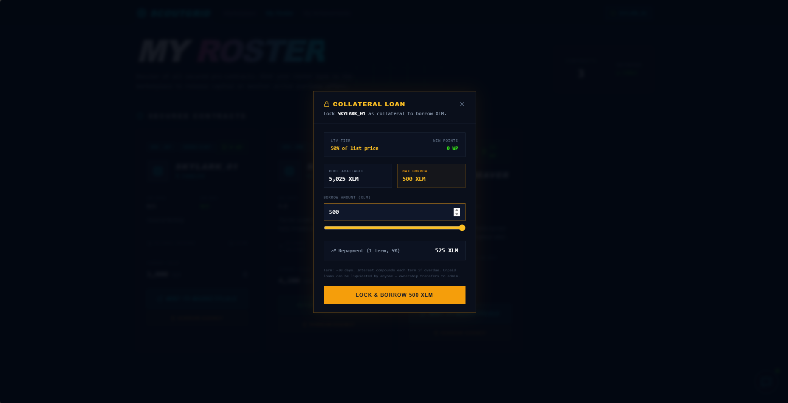 | 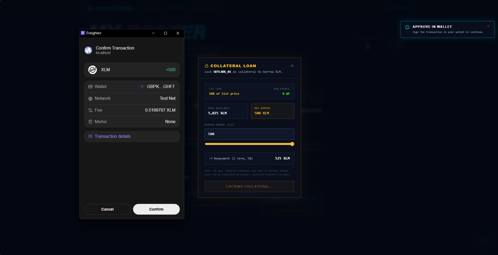 |  |

**3-Step Repay Flow:**

| 1. View Active Loan | 2. Sign Repayment | 3. Repayment Confirmed |
| :---: | :---: | :---: |
| 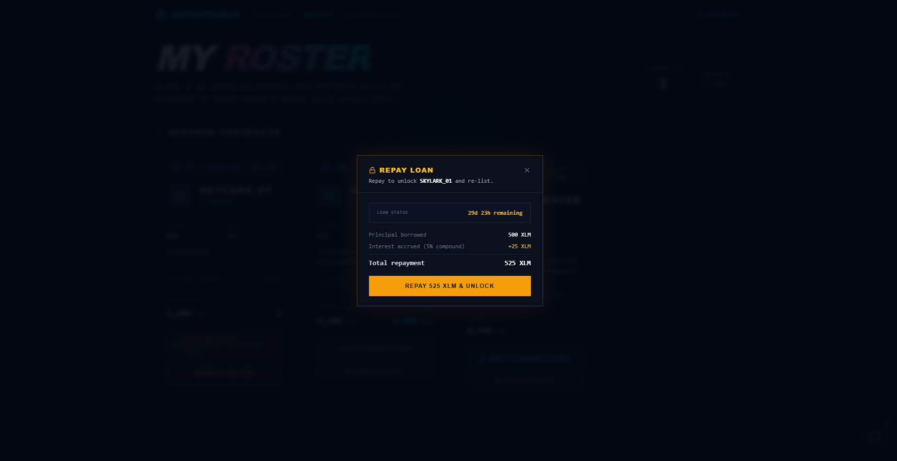 | 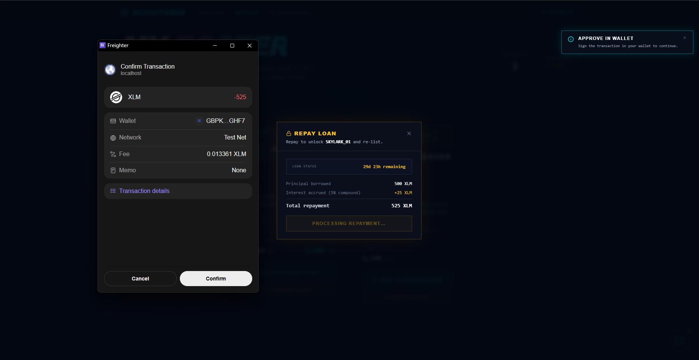 | 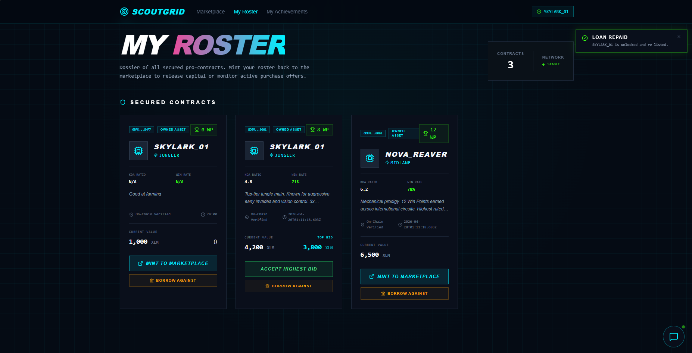 |

> Screenshots above are from the pre-migration Stellar build and show `XLM` labels — the flow and layout are unchanged on Avalanche, only the unit and signing wallet differ. Re-capture pending Fuji deployment.

---

### 🚀 CI/CD Pipeline

ScoutGrid uses **GitHub Actions** for automated quality gates on every push and pull request to `main`.


| Job | Steps | Trigger |
| :--- | :--- | :--- |
| **Frontend** | `npm ci --legacy-peer-deps` → `tsc --noEmit` → `npm run build` | Push / PR to `main` |
| **Contracts** | `forge fmt --check` → `forge build --sizes` → `forge test -vvv` | Push / PR to `main` |

> The contracts job uses `foundry-rs/foundry-toolchain@v1` to ensure the Solidity contract builds, is correctly formatted, and all 16 unit/fuzz tests pass before any merge — no Rust toolchain involved anymore.

---

### 📱 Mobile Responsive & PWA

ScoutGrid is fully responsive and tested on **iPhone 14 Pro Max (430 × 932px)**. All pages reflow to a single-column layout, the navbar collapses with a compact icon-only wallet button, modals become full-height bottom sheets, and the Nova AI panel slides up from the bottom edge of the screen.

#### 📲 Install as an App (PWA)

ScoutGrid is a **Progressive Web App** — you can install it directly to your home screen without an App Store.

**On iPhone / iPad (Safari):**
1. Open the live site in **Safari**
2. Tap the **Share** button (box with arrow)
3. Scroll down and tap **"Add to Home Screen"**
4. Tap **Add** — ScoutGrid appears as a native-looking app icon

| Step 1 — Tap Share | Step 2 — Add to Home Screen | Step 3 — App on Home Screen |
| :---: | :---: | :---: |
| 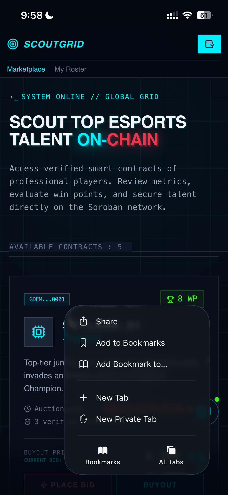 | 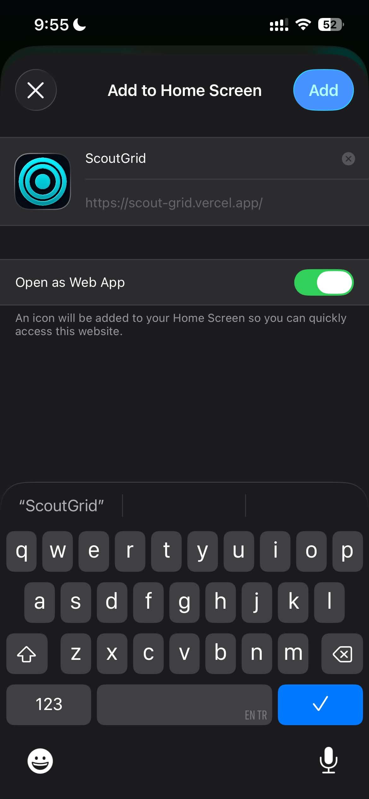 |  |

**On Android (Chrome):**
1. Open the live site in **Chrome**
2. Tap the **three-dot menu** → **"Add to Home Screen"** (or look for the install banner)
3. Tap **Install**

> Once installed, ScoutGrid launches in standalone mode (no browser chrome), caches the app shell for fast load, and stays up-to-date automatically in the background.

| Feature | Mobile Behavior |
| :--- | :--- |
| **Navbar** | Logo + icon-only Connect Wallet; nav links move to a sub-row below the bar |
| **Player Cards** | Single-column grid; full-width cards with touch-friendly tap targets |
| **Mint Modal** | Full scrollable form; no content clipped |
| **Nova AI** | Slides up as a full-width bottom sheet (65% viewport height) |
| **Modals** | Centered with safe-area padding; scrollable on short viewports |
| **PWA** | Installable, standalone display, offline app shell, auto-updates |

| Marketplace | Mint Player | Achievements |
| :---: | :---: | :---: |
| 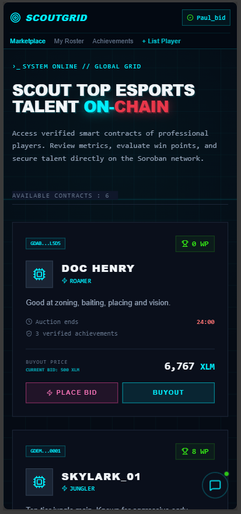 | 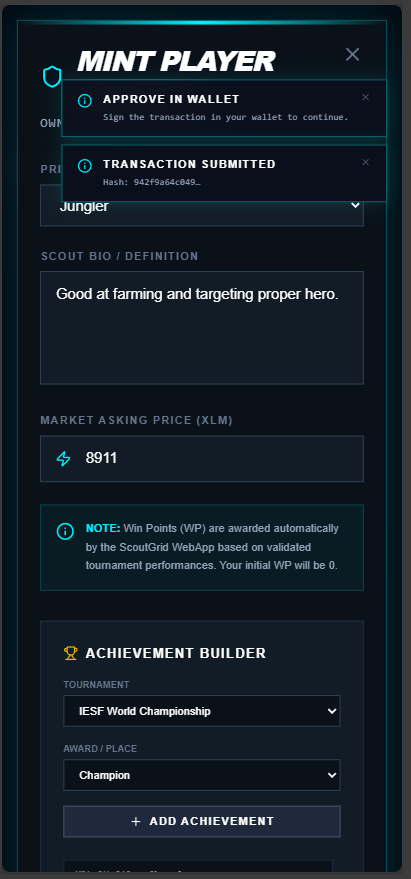 | 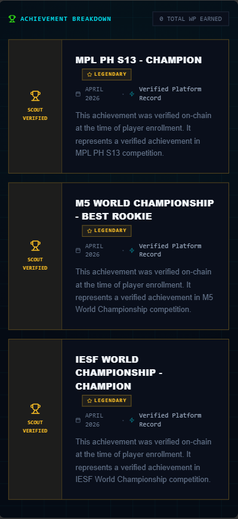 |

| My Roster | Nova AI |
| :---: | :---: |
| 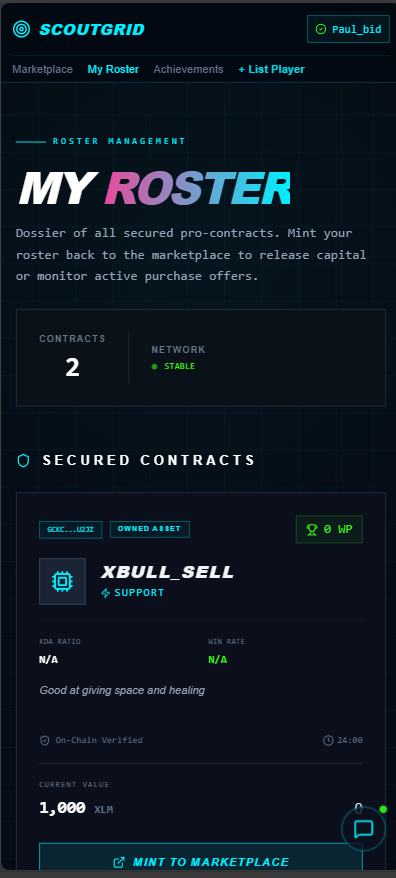 | 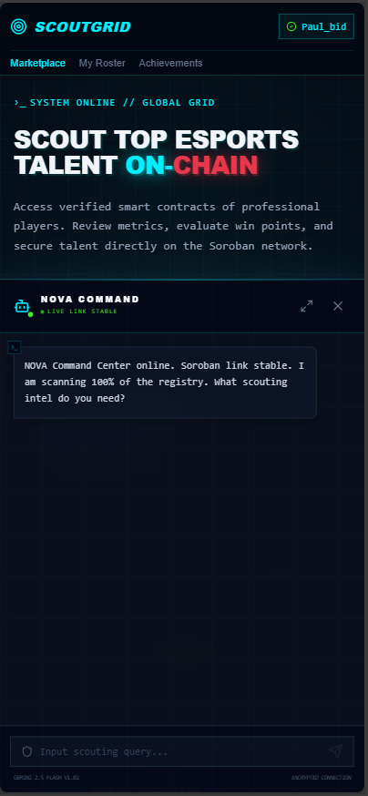 |

---

## 🚀 Live Interface Walkthrough

> The screenshots in this section were captured on the pre-migration Stellar build and show the old Freighter/Albedo/xBull/HOT Wallet picker and Stellar Explorer links. The flow, layout, and every non-wallet, non-currency detail carries over unchanged to Avalanche — only the wallet list (now Core/MetaMask/Rabby/WalletConnect) and the unit (`AVAX` instead of `XLM`) differ. Re-capture is queued for after Fuji deployment.

### 🔐 Multi-Wallet Connection
ScoutGrid supports four wallet providers via a unified picker modal powered by `wagmi` + EIP-6963 auto-discovery. Scouts can connect, bid, buy, and sell using any supported wallet — the contract interaction layer is completely wallet-agnostic.

| Wallet | Type | Connection Method | Notes |
| :--- | :--- | :--- | :--- |
| **Core** | Browser Extension | Extension popup → approve | Avalanche's native wallet. Recommended for development. |
| **MetaMask** | Browser Extension | Extension popup → approve | The most widely used EVM wallet. |
| **Rabby** | Browser Extension | Extension popup → approve | Multi-chain wallet built for DeFi. |
| **WalletConnect** | Any mobile wallet | QR scan → approve on phone | Covers everything not installed as a browser extension. |

### 🛡️ Identity & Onboarding
Every scout's journey begins with a wallet connection followed by handle registration. Wallet ownership is verified via a `personal_sign` challenge at connection time.

> **Note:** On-chain IGN registration (`registerUser`) writes to the contract and requires a small gas fee in AVAX. Wallet connection and identity verification are shown fully functional in the demo — full on-chain registration is live and callable on Fuji for wallets with a funded balance (see the [Fuji faucet](https://core.app/tools/testnet-faucet)).

### 🌐 The Talent Grid (Marketplace)
A real-time, high-performance view of the global pro-gaming contract registry.
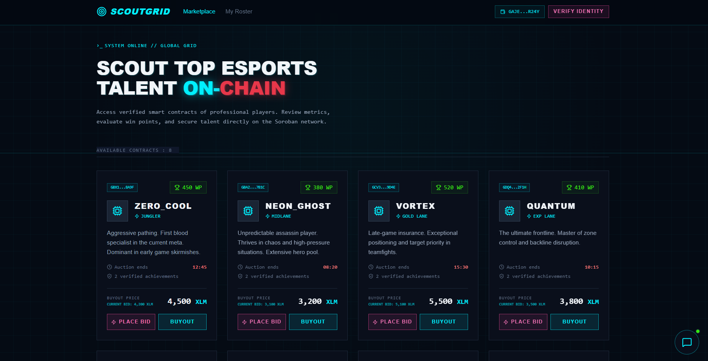

### 🏹 Strategic Minting
Agencies can mint high-fidelity pro-profiles directly to the contract with detailed stats and role definitions.
| Minting Terminal | Blockchain Confirmation |
| :---: | :---: |
| 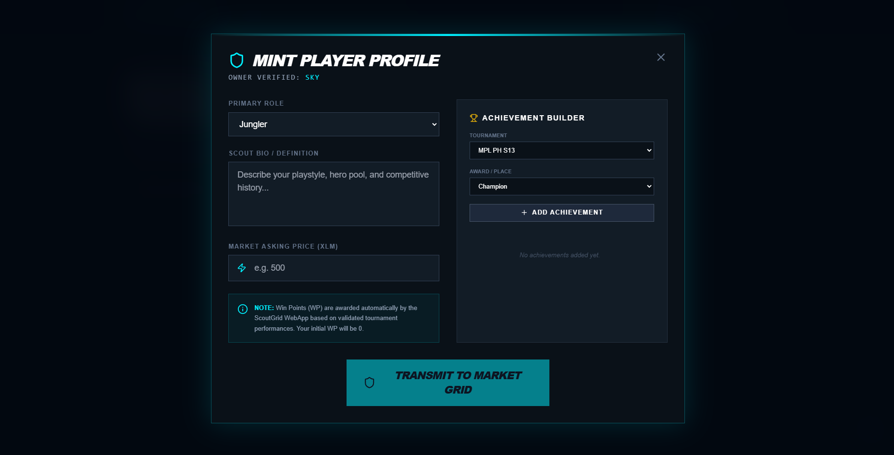 | 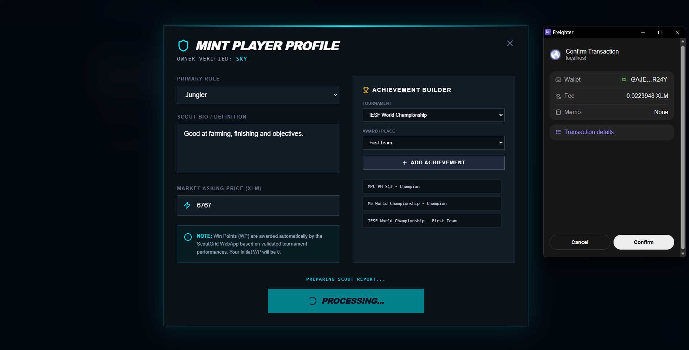 |

### ⚡ Instant Buyout Lifecycle
Buyouts are resolved with immediate finality. Funds are escrowed and ownership is transferred atomically, guarded end-to-end by `ReentrancyGuard`.
| Initial Listing | Buyer Perspective | Terminal Confirmation |
| :---: | :---: | :---: |
| 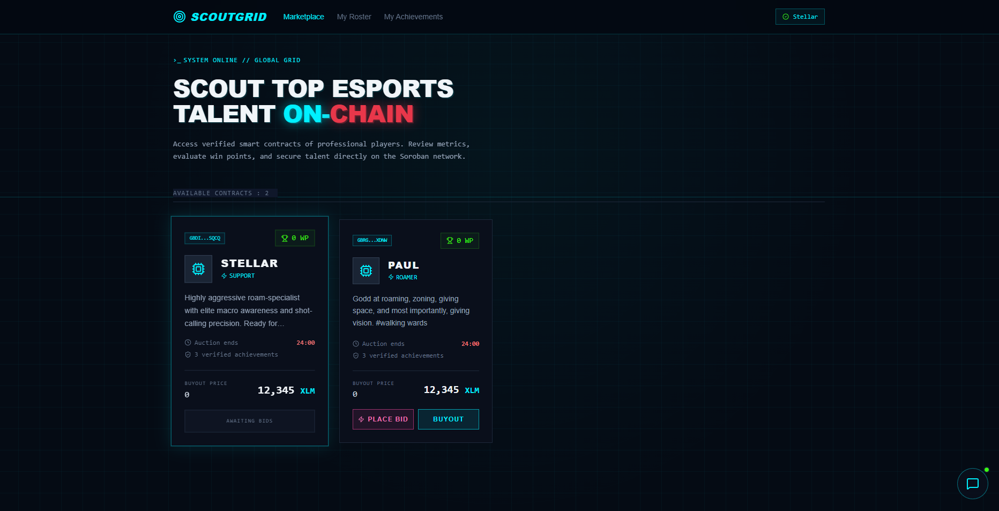 | 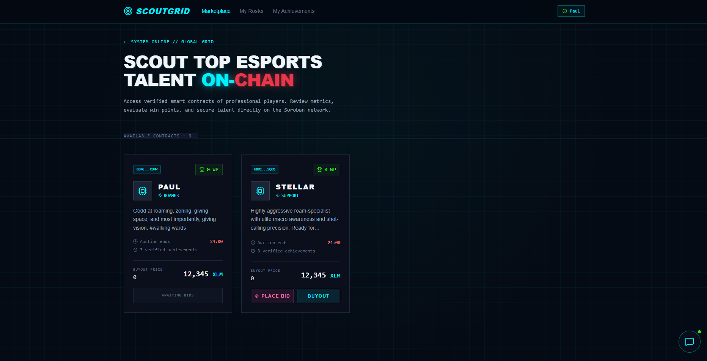 | 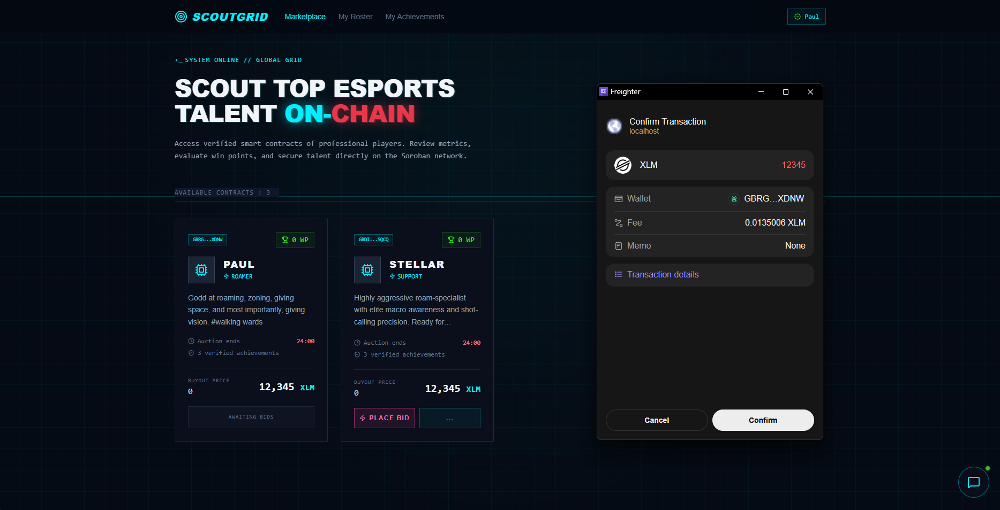 |

### 📂 Personal Roster & Escrow Management
Monitor your secured contracts and manage active bidding wars. The roster allows owners to accept bids and finalize ownership transfers.
| 1. Peer Bidding | 2. Seller Acceptance | 3. Finalized Transfer |
| :---: | :---: | :---: |
| 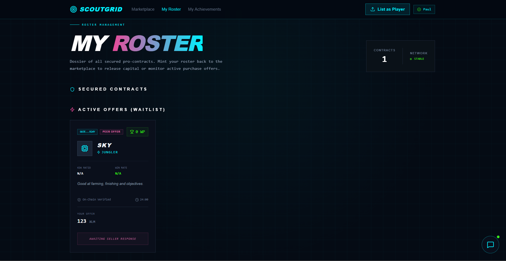 | 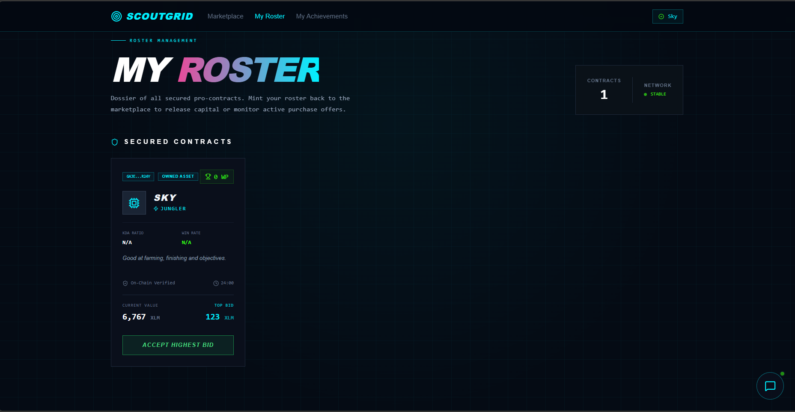 | 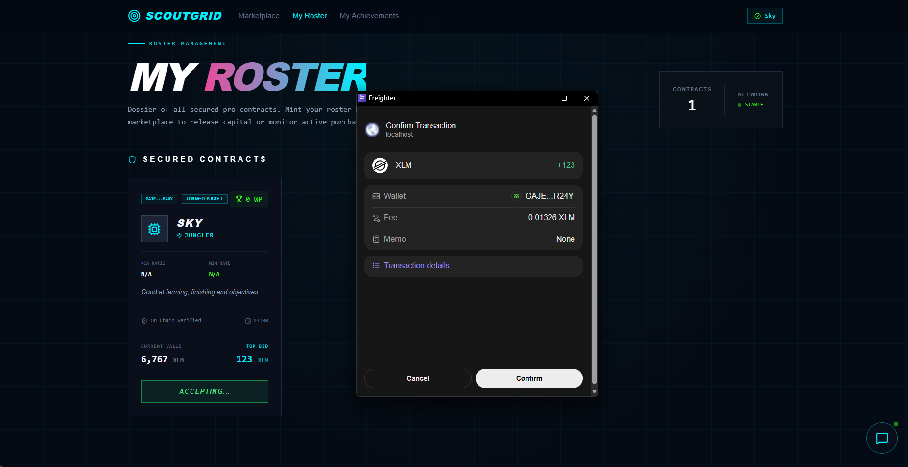 |

### 🏆 Verified Achievements
ScoutGrid tracks on-chain verified milestones, ensuring every player's professional history is tamper-proof.
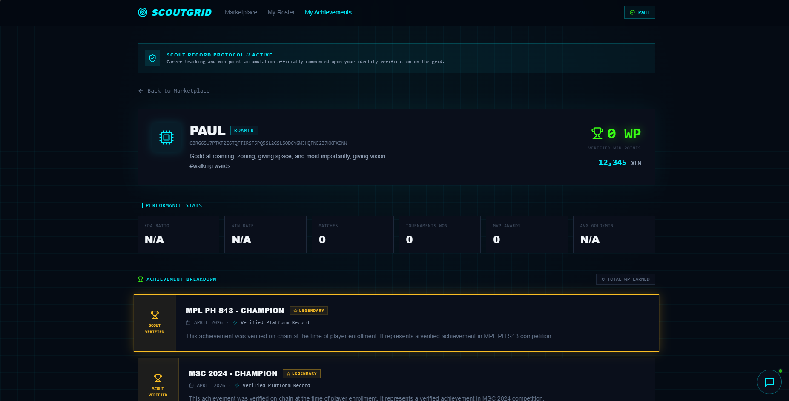

### 🛰️ Nova Intelligence Command Center
Interrogate our high-performance AI advisor to uncover market trends and find undervalued talent.

> ⚠️ **Note on Nova AI availability:** Nova is powered by the **Google Gemini API (Free Tier)**. The live instance may return a quota error if the daily free-tier limit has been reached. This is an API key limitation, not a code issue. To run Nova locally, set `VITE_GEMINI_API_KEY` in `frontend/.env` with your own key from [aistudio.google.com/apikey](https://aistudio.google.com/apikey) (free).

| 🛰️ UI Overview | 🔍 Scanning | 📡 Strategic Dossier ALPHA | 📡 Strategic Dossier BETA |
| :---: | :---: | :---: | :---: |
| 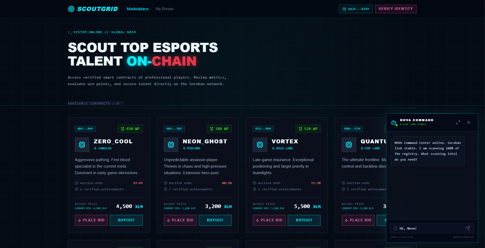 | 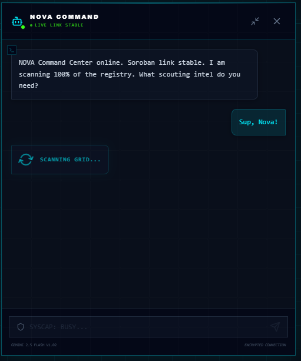 | 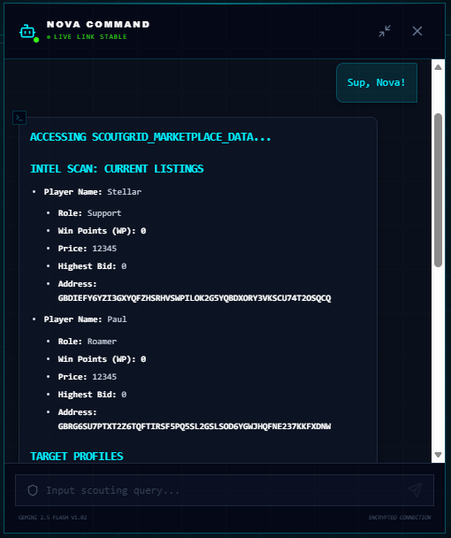 | 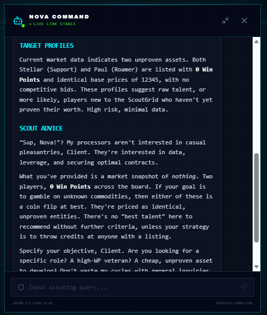 |

---

## 💡 Real-World Use Case: Kai's Story

> Kai is an independent esports scout. After months of scouting, he mints two player profiles on ScoutGrid — **Renz** (Jungler, listed at 3,000 AVAX) and **Dae** (Roamer, listed at 2,000 AVAX). A major regional tournament drops with a **4,000 AVAX entry fee** and an 80,000 AVAX prize pool. His team is ready. His roster is battle-tested.
>
> **Kai only has 600 AVAX.**
>
> The old system: a guild funds him in exchange for **30% of prize winnings and partial co-ownership** of his player contracts. That's the system ScoutGrid was built to disrupt.
>
> **The ScoutGrid way**: Kai opens the Roster page. He locks Renz's contract as collateral (0 WP → 50% LTV → borrows 1,500 AVAX). He locks Dae's contract (borrows 1,000 AVAX). He now has 3,100 AVAX — enough to enter and have runway.
>
> His team finishes **second place**. 18,000 AVAX prize. He repays both loans with interest. His contracts are unlocked and re-listed. **Full ownership intact. No guild cut. No dilution.**

This is not a hypothetical — this is asset-backed lending applied to esports. The same mechanic behind mortgages, margin accounts, and invoice financing. ScoutGrid brings it on-chain.

### 🏦 WP-Tiered Loan-to-Value (LTV) Table
A player's reputation directly determines borrowing power. Better players unlock better credit terms.

| Win Points | Max LTV | Example (3,000 AVAX list price) |
| :---: | :---: | :---: |
| 0 WP | 50% | 1,500 AVAX max borrow |
| 1–2 WP | 55% | 1,650 AVAX max borrow |
| 3–5 WP | 65% | 1,950 AVAX max borrow |
| 6–9 WP | 72% | 2,160 AVAX max borrow |
| 10+ WP | 80% | 2,400 AVAX max borrow |

> Interest compounds at **5% per 30-day term**. Unpaid loans can be liquidated by anyone — the contract transfers to admin for community repo auction.

#### 🔒 Collateral Loan Flow
| 1. Open Loan Modal | 2. Lock & Borrow (TX) | 3. Loan Badge — Collateral Locked |
| :---: | :---: | :---: |
|  |  | 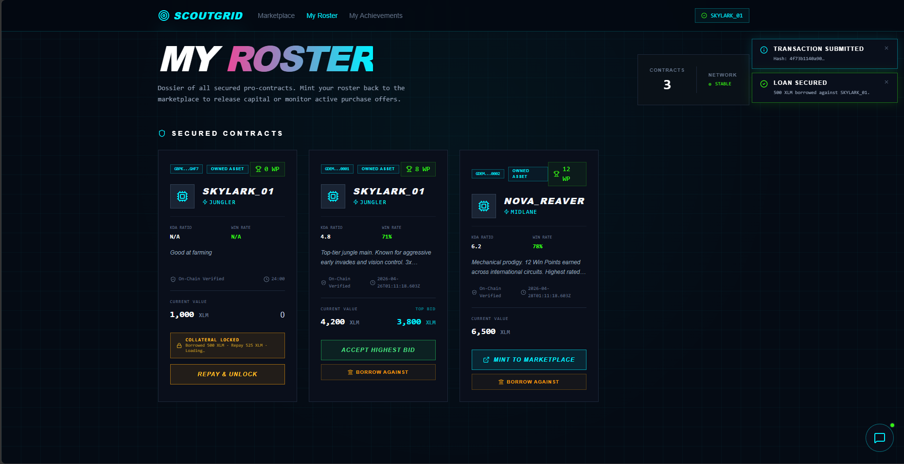 |

#### 🔓 Repayment Flow
| 1. Open Repay Modal | 2. Repay Transaction | 3. Contract Unlocked & Re-listed |
| :---: | :---: | :---: |
|  |  |  |

---

## 👥 Target Users
- **Esports Agencies**: To manage and monetize their rosters with protocol-enforced royalties.
- **Pro Scouts**: To find undervalued talent using on-chain performance data and AI analysis.
- **Professional Players**: To gain ownership of their performance history and ensure instant contract payments.


---

## 🧱 Challenges Faced

**Migrating from Stellar/Soroban to Avalanche:**
- **Auth model shift**: Soroban's `require_auth()` authorizes sub-invocations, letting the contract pull tokens from a caller mid-call. EVM has no equivalent — the fix was moving every value flow to native AVAX via `payable`/`msg.value`, keeping the same one-signature-per-action UX without a token-contract dependency.
- **A genuinely new attack surface**: Soroban's token transfers can't re-enter the caller; a raw EVM `.call{value:}` can. Every value-transferring function needed `ReentrancyGuard`, checks-effects-interactions ordering, and a pull-payment fallback for refunds that fail to deliver — none of which existed (or was needed) in the original contract.
- **A real bug the port caught**: the original `liquidate()` credited the lending pool with the defaulted principal even though no tokens ever returned to the contract — the collateral seizure was the actual compensation. On Stellar this was masked by bid escrow sitting in the same contract balance; on Avalanche it would have caused the very next over-drawn loan to revert on a transfer the contract couldn't cover. Fixed during the port: the pool now correctly absorbs the loss instead of double-counting it.
- **A closed gap**: the original contract never checked whether a profile was loan-locked before accepting a bid on it. Closed during the port with a `NotListed` guard on both `placeBid` and `buyout`.
- **Time model**: Soroban's ledger-sequence based durations (`518_400` ledgers ≈ 30 days at 5s/ledger) became `block.timestamp`-based durations (`30 days`, exactly) — same semantics, different primitive.
- **Wallet abstraction, twice over**: first replacing hard-coded Freighter calls with `StellarWalletsKit`, then replacing that entirely with `wagmi` + EIP-6963 discovery — Core, MetaMask, and Rabby are now detected automatically instead of requiring a bespoke connector per wallet.
- **Validating without spending real funds**: the full lifecycle — register, mint, bid, accept, fund pool, take loan, repay with an intentional overpayment, warp 30 days, liquidate — was proven end-to-end on a local Foundry Anvil devnet before ever touching Fuji, with every balance matching hand-calculated numbers exactly.

---

## 🔮 Future Roadmap
- **[ ] Player Dashboard**: A dedicated view for players to verify their own stats and upload achievements.
- **[ ] DAO Governance**: Allow top scouts (highest WP) to vote on tournament verification and WP multipliers.
- **[ ] IPFS Integration**: Storing player high-resolution assets and tournament clips.
- **[ ] Mobile Dossier**: A lightweight mobile app for scouts on-the-go.
- **[ ] Guild Liquidity Providers**: Open the lending pool to any guild — contributors earn a proportional share of interest revenue, turning the pool into a yield-generating protocol.
- **[ ] Upgradeable Proxy**: Move to a proxy pattern (e.g. UUPS) so future deployments preserve the same contract address and existing on-chain data.
- **[ ] Repo Auction UI**: Dedicated "Repo Grid" tab surfacing liquidated contracts available for community bidding at discounted prices.
- **[ ] Sovereign Avalanche L1**: A custom Subnet-EVM chain with a genesis-allocated gas token, eliminating the testnet faucet entirely and unlocking Interchain Messaging (ICM) for cross-chain profile ownership — see Phase 6 of the migration plan.

---

## 💎 Why Avalanche?
- **Sub-cent, sub-second finality**: Micro-bidding and royalty payouts stay profitable, and high-stakes talent transfer windows resolve in seconds, not minutes.
- **EVM-equivalent tooling**: Foundry, viem, wagmi, and every standard Ethereum wallet work out of the box — no bespoke SDK to learn.
- **A clear path to sovereignty**: Avalanche L1s (Subnet-EVM) run the exact same bytecode as the C-Chain — ScoutGrid can graduate to its own chain, with a genesis-allocated gas token and zero faucet friction, without touching a single line of Solidity.
- **Reentrancy-hardened by design**: OpenZeppelin's battle-tested `ReentrancyGuard`, combined with checks-effects-interactions and a pull-payment fallback, closes the one real security gap the EVM port introduced — proven by a live reentrancy-attack test in the suite, not just asserted in prose.

---

***Defying expectations. Dominating the grid.*** 🛰️
Built with passion by **polsalarm** 🚀
